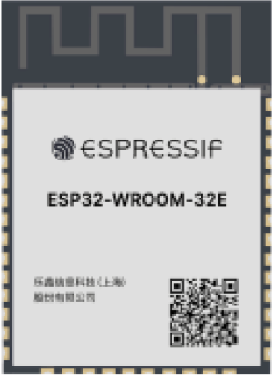
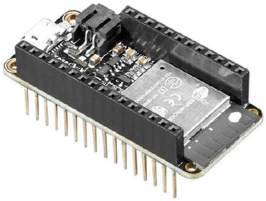
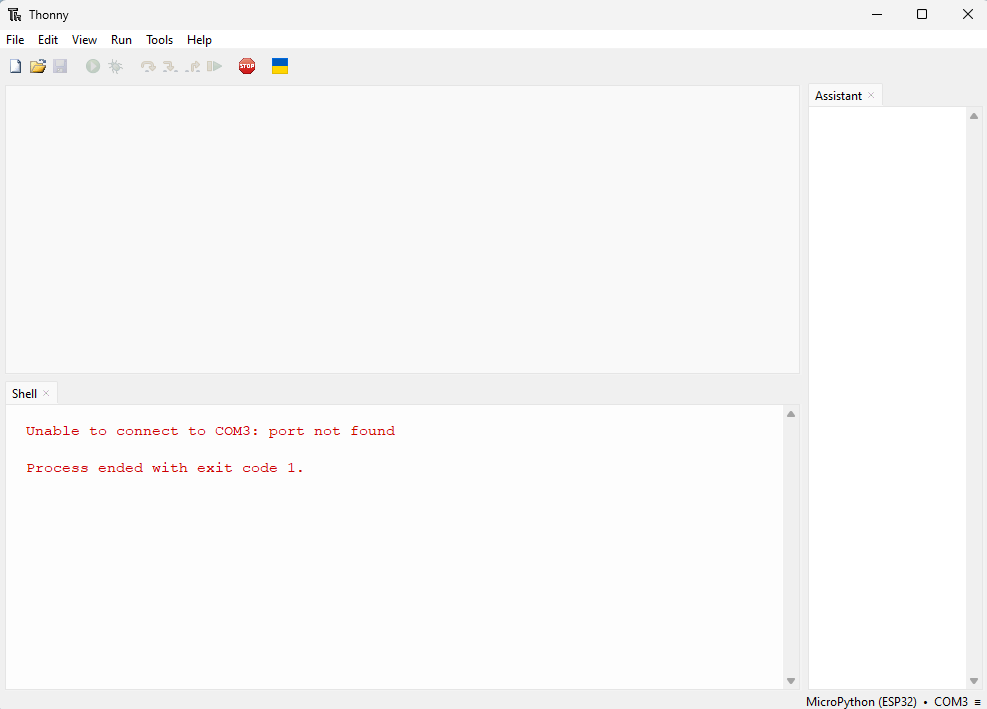

---
mathjax:
  presets: '\def\lr#1#2#3{\left#1#2\right#3}'
---

# Introductie

Een microcontroller (afgekort μc of MCU) is een geïntegreerde schakeling met een microprocessor die gebruikt wordt om elektronische apparatuur te besturen. Om van een microcontroller te spreken moet het systeem minimaal bestaan uit een cpu, geheugen en I/O (=Ingangen/Uitgangen). De microcontroller is tegenwoordig niet meer weg te denken. Bijna alle moderne apparaten bevatten een microcontroller, denk aan wasmachines, telefoons, auto’s, robotgrasmaaiers, afstandsbedieningen, ... Microcontrollers worden gebruikt bij het automatiseren en controleren van apparaten.

.")

:::tip
Een microcontroller is een IC (Integrated Circuit) waarop een programma draait dat door de ontwerper is geschreven. Het programma wordt regel per regel uitgevoerd.
:::

## Hardware

De microcontroller die hier wordt gebruikt is de ESP32-WROOM32 van de firma Espressif.

Er zijn verschillende versies van de ESP32 op de markt te verkrijgen. Verschillende fabrikanten hebben hun eigen versie op de markt gebracht. Het nadeel van dit aanbod is dat er naar pincompatibiliteit geen afspraken zijn gemaakt en er dus afwijkingen kunnen zijn op dat vlak tussen de verschillende types ESP32. In deze cursus wordt de focus gelegd op de Adafruit Feather HUZZAH32 ESP32 4Mb. Deze controller maakt gebruik van de WROOM32 module van Espressif.

De Huzzah32 heeft een ingebouwde USB-naar-serieel-converter, automatische bootloader-reset, lithium-ion-/polymeeroplader en alle GPIO’s (=General Purpose Input Output) zijn naar buiten gebracht.

***
De module heeft een 32 bit dual-core ESP32-chip, 4 MB SPI Flash, afgestemde antenne en alle passieve elementen die je nodig hebt om te profiteren van deze krachtige processor met een klokfrequentie tot 240MHz en 512kB RAM. De ESP32 heeft zowel WiFi als Bluetooth Classic/LE-ondersteuning. Dat betekent dat het perfect is voor vrijwel elk draadloos of internet-verbonden project.
***

De ESP32 is een perfecte upgrade van de ESP8266 die zo populair is geweest. Ter vergelijking: de ESP32 heeft veel meer GPIO, veel analoge ingangen, twee analoge uitgangen, meerdere extra randapparatuur (zoals een reserve UART), twee cores zodat je niet hoeft toe te geven aan de WiFi-manager, een veel snellere processor, … .

## Software

De ESP32 kan via verschillende platformen worden geprogrammeerd. Het is heel populair om deze te programmeren via de Arduino IDE in een C++ taal. Echter zullen we hier Thonny-IDE editor gebruiken om de controller te programmeren in Python. IDE is de afkorting van Integrated Development Enveronment en kan vertaald worden als een geïntegreerde ontwikkelomgeving.

Thonny, is een IDE die voor verschillende doeleinden kan worden gebruikt. Je kan Thonny gebruiken voor ontwikkelingen met Python.

De Thonny IDE is een goede ontwikkelomgeving voor python code voor zowel computer als microcontrollers. Voor de microcontroller wordt niet dezelfde python omgeving gebruikt als python scripts voor op de computer, maar hier wordt gebruik gemaakt van MicroPython. Dit is een ontwikkelomgeving die specifiek is ontwikkeld voor microprocessoren en controllers. Tevens bezit Thonny een Serial Terminal scherm die het mogelijk maakt om tijdens de run van de ESP32 serieel data te kunnen uitwisselen. Dit kan een ondersteuning zijn voor het debuggen van uw code.

:::warning
Een echte debug-tool met breakpoints is zonder extra hardware echter niet mogelijk, maar het kan wel.
:::

:tada: :100: