# Installatie van Visual Studio Code

Om Visual Studio Code te installeren ga je naar de website:

[https://code.visualstudio.com/download/](https://code.visualstudio.com/download/)

Klik op Windows (1) zoals in volgende figuur.

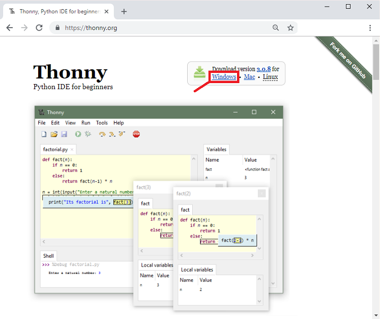

Klik op de gedownloade executable zoals in volgende figuur is weergegeven.

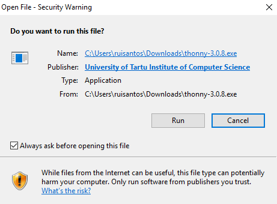

Selecteer vervolgens de taal en klik op ‘OK’ (1).

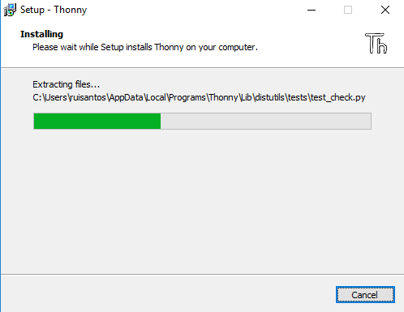

Klik vervolgens op ‘I accept the agreement’ (1) en dan op ‘Next’ (2).

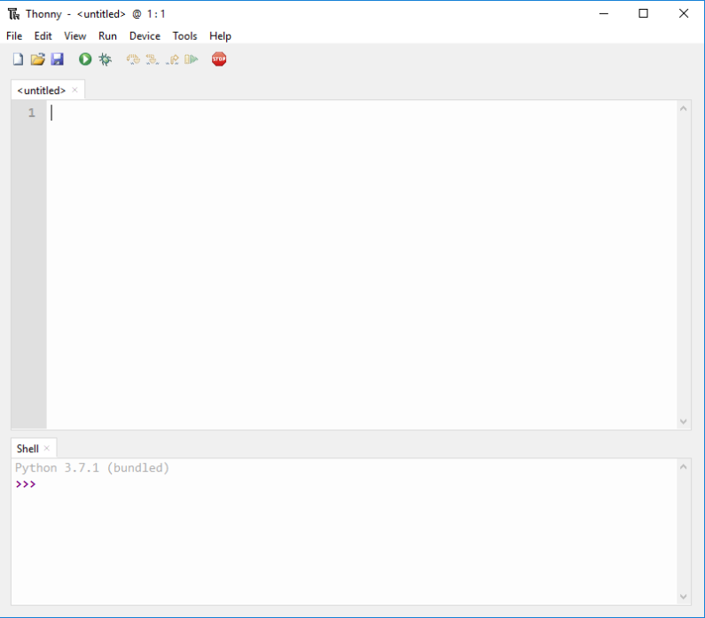

Klik op ‘Next’ (1).

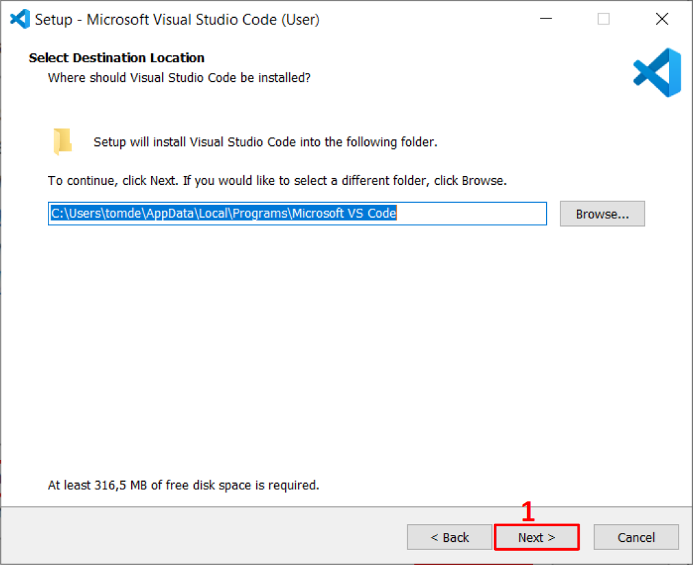

Klik op ‘Next’ (1).

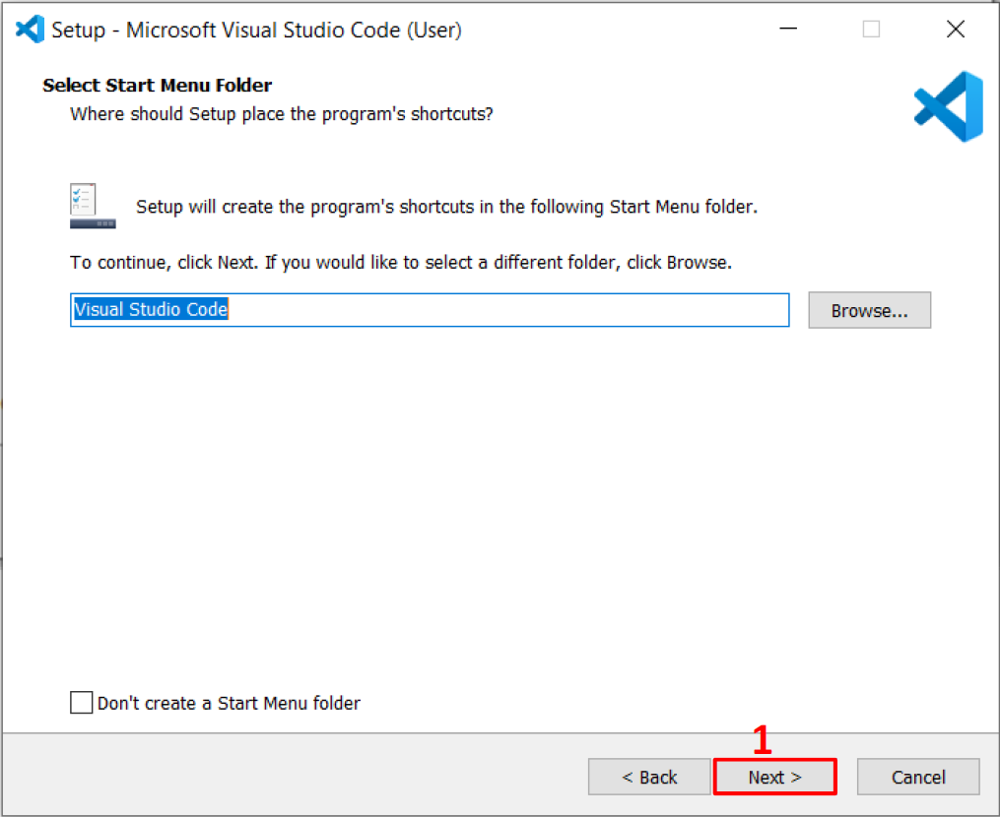

Selecteer de selectievakjes (1) en (2) en klik op ‘Next’ (3).

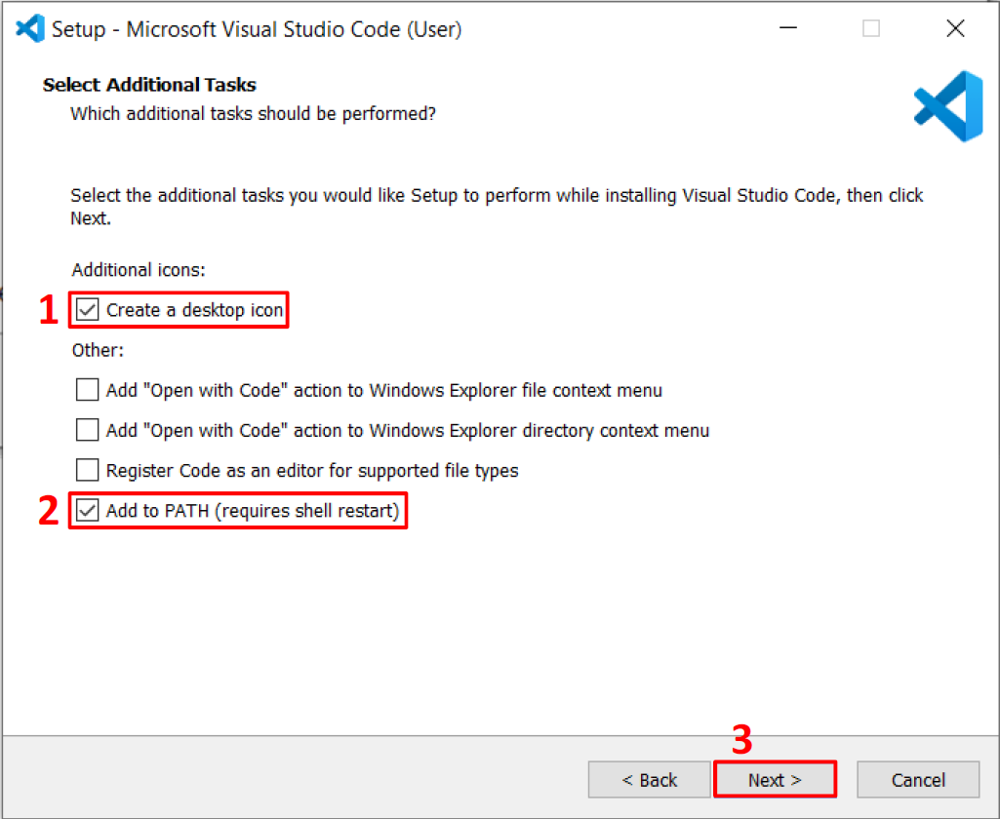

Klik op ‘Install’ (1) om het installatieproces te starten.

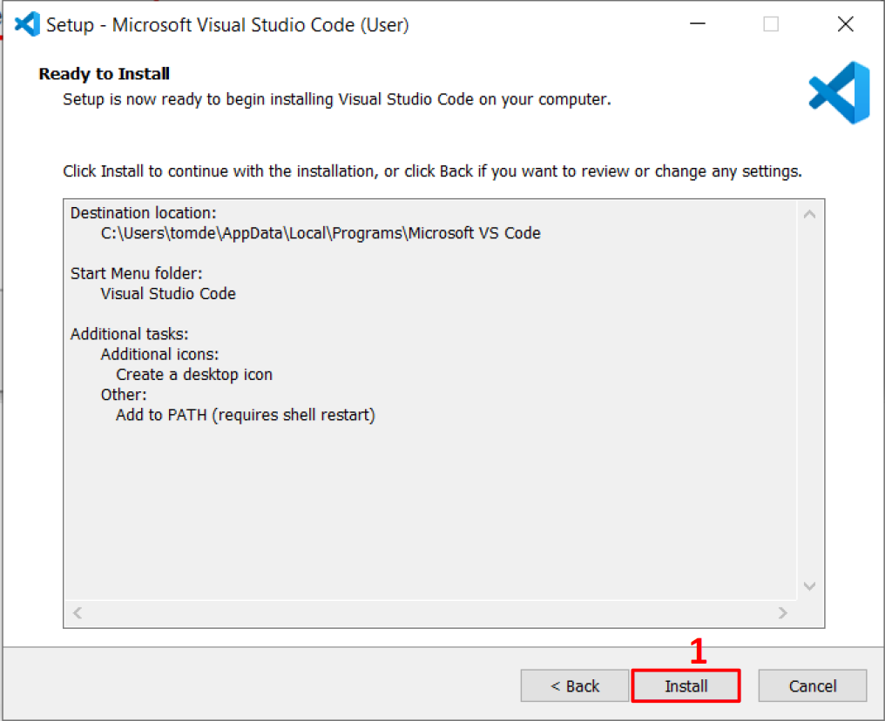

Klik op ‘Finish’ (1) om het installatieproces te beëindigen.

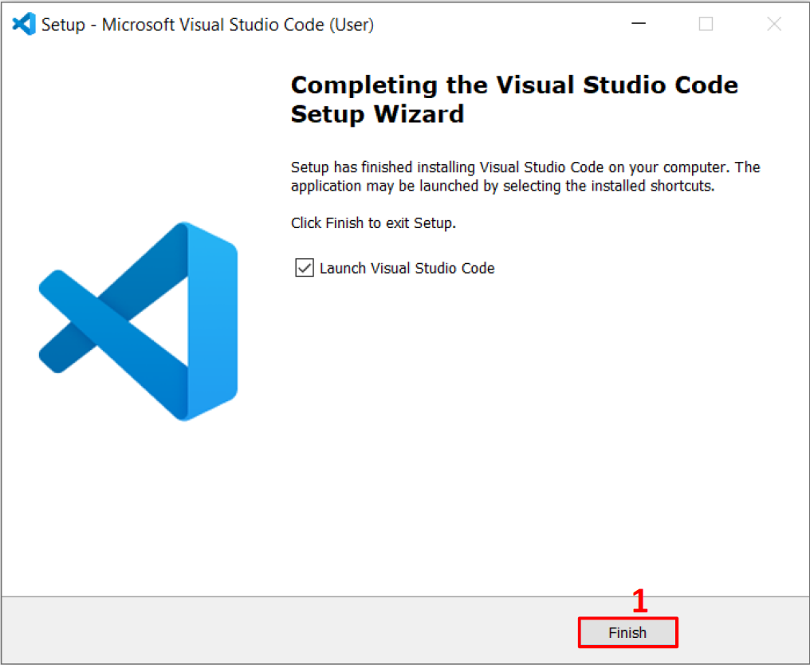

Open Visual Studio Code en je wordt begroet met de nieuwste realease notes van het programma.

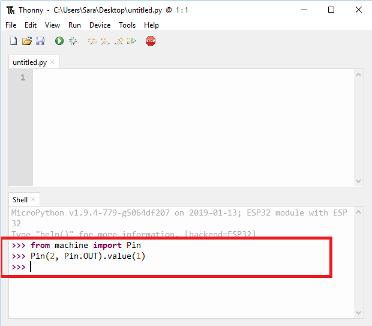

## Installatie van de PlatformIO IDE extension

Het is mogelijk om vanuit Visual Studio Code de ESP32 te programmeren maar daarvoor moet de extensie PlatformIO geïnstalleerd worden in VSC.

Start Visual Studio Code op. Selecteer het extension-icon (1). Typ ‘platformio ide’ in, in het zoekvenster (2). Selecteer Platformio IDE (3) en klik op ‘Install’ (4).

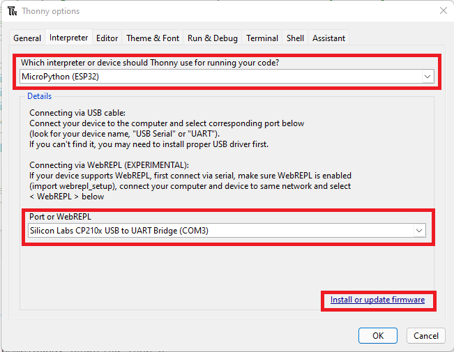

Als de installatie volledig is uitgevoerd, dan staat er een vinkje naast installed (1). Klik vervolgens op de knop ‘Disable’ (2) en vervolgens op Enable zodat de extansie zeker geactiveerd is zoals in de volgende figuur.

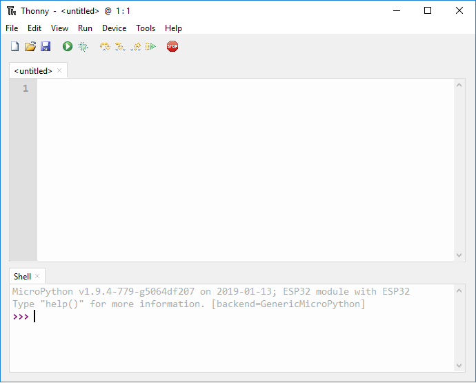

Je kan zien dat de extensie geactiveerd is door het vinkje naast ‘Enable’ (1).

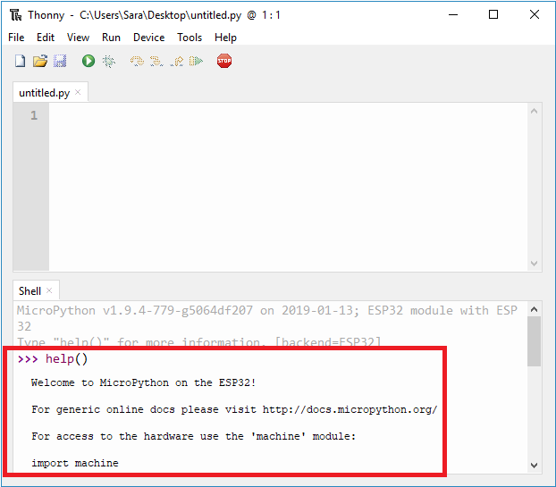

Klik links op het icoon van PlatformIO (1). Als het niet zichtbaar zou zijn sluit je VSC af en start je het programma opnieuw op. Het heropstarten na een installatie van een extensie is sowieso aangewezen om te doen. Klik vervolgens op de home knop (2) zodat je het scherm van volgende figuur te zien krijgt.

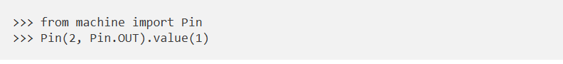

Visual Studio Code is klaar om de ESP32 te programmeren, te debuggen en het programma in de controller te laden.

***
