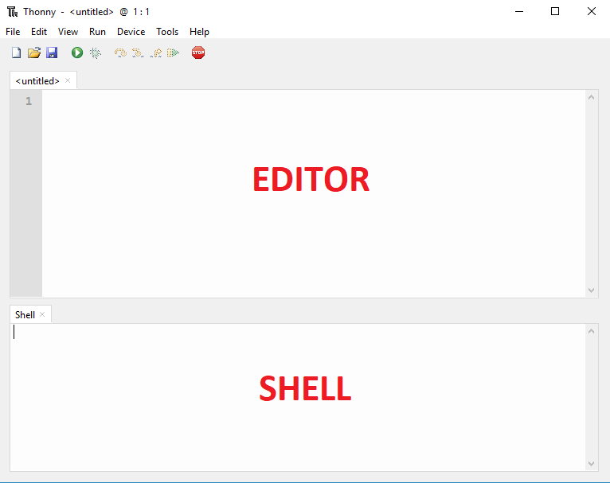
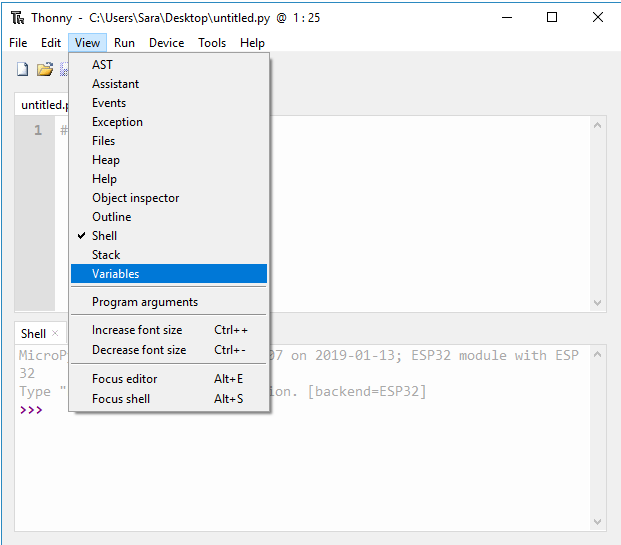

# Quick overview van VSC en PlatformIO

In de volgende figuur is een overzicht te zien van de belangrijkste icoontjes (1) t.e.m. (5) met hun betekenis en hun shortcuts.

Daarenboven kan met Ctrl+Shift+P of door te klikken op View > Command Palette ... kunnen alle commando's worden weergegeven. Als een commando moet worden gezocht dan kan de shortcut worden gevonden in het Command Palette (zoek daarbinnen).

Onderaan VSC wordt een blauwe werkbalk met icoontjes weergegeven dat belangrijk is in het gebruik met de ESP32.

Met volgende mogelijkheden:
> - PlatformIo Home (1);
> - Build/Compile (2);
> - Upload het programma naar de controller (3);
> - Verwijder het programma (4);
> - Start de serial monitor (5);
> - Open een nieuw venster (6).

***

