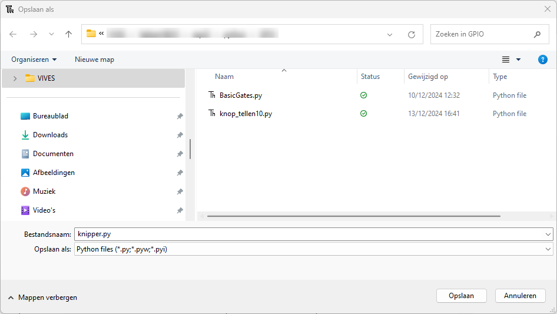
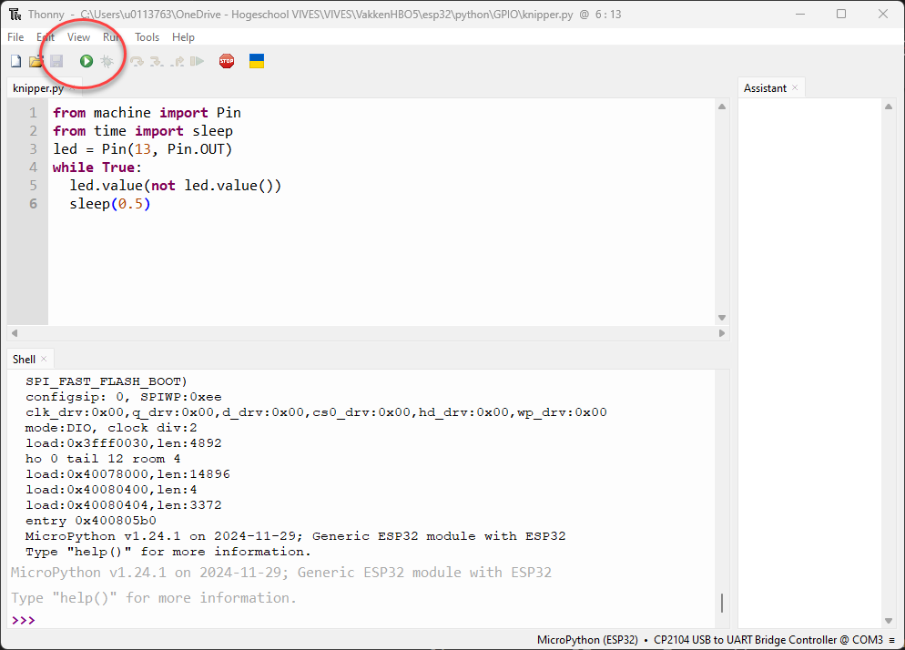

# Een eerste Python script ingeven en uitvoeren
Om nu met het geheel te werk te gaan (schrijven van code, compileren en uploaden naar de microcontroller) wordt nu vertrokken vanuit een klassiek voorbeeld om tot een knipperende LED te komen (blinking LED).

Er zijn echter twee manieren om een script uit te voeren op de microcontroller.

> - de eerste manier is door een python bestand aan te maken op de computer en die te laten uitvoeren op de microcontroller. Dat gebeurt door op het groene driehoekje te klikken (F5), Run current script te klikken. Hierbij wordt het script aangeboden aan de MicroPython omgeving op de microcontroller en zal deze het script uitvoeren. Let wel: het script wordt niet bewaard op de microcontroller. Na een reset van de ESP32 is het script niet aanwezig op de microcontroller en kan het dus ook niet meer worden uitgevoerd. Het script staat wel als .py bestand op de computer.
> - de tweede manier is om de Python script code te bewaren op de micrcontroller zelf. Gebeurt dit onder de naam main.py of boot.py, dan zal het script telkens worden uitgevoerd na een reset van de microcontroller.

## Eerste manier

Open Thonny IDE, maak een nieuw .py bestand aan, save dit bestand op een specifieke map op de computer. Schrijf volgende code in dit .py bestand:

```python
from machine import Pin
from time import sleep
led = Pin(13, Pin.OUT)
while True:
  led.value(not led.value())
  sleep(0.5)

```

Uitleg code: 
> - om een pin als GPIO te gebruiken van de ESP32 moeten specifieke eigenschappen van de ESP32 worden geladen. Dit gebeurt door binnen de library MACHINE de PIN eigenschappen te laden.
> - idem voor het gebruik van een WACHT-insctructie (SLEEP) die moet geladen worden vanuit de TIME library.
> - led is een variabele van het type PIN en krijgt de eigenschappen van een nummer (Pin nummer van de microcontroller), en dat die piin een uitgang is (om een LED aan te sturen).
> - in de oneindige lus (while True), wordt telkens de toestand van die uitgang gelezen door de ESP32 en wordt het inverse als value geschreven naar die specifieke pin.
> - daarna wordt er een tijdje gewacht (sleep) met een eigenschap van 0,5 seconden.

Bewaar deze code in een python bestand (naam van het bestand maakt niet uit, let wel extensie is .py). Kies voor de optie : This Computer. Bepaal zelf in welke map je dit allemaal verzamelt.




Geef het project een steed een goeie logische naam: vb. : "Blink_LED". 

Let op de locatie van uw project binnen de mappenstructuur van uw computer. Gebruik hiervoor logische structuren zodat je later uw projecten kan terug vinden!!



Schrijf de code en klik op het groene driehoekje. De onboard LED op de ESP32 (aangesloten op pin 13) knippert.

De uitvoering stoppen kan door op de STOP knop te klikken in Thonny.

## Tweede manier

Bij de tweede manier is de code hetzelfde. De bestandsnaam moet hier echter main.py of boot.py zijn.
Kies bij het opslaan nu voor MicroPython device (wat de ESP32 hier is).


Het kan wel zijn dat je nu de ESP32 eens moet resetten. Nu wordt het programma uitgevoerd. Het programma kan niet gestopt worden. Enkel het overschrijven van de main.py of boor.py op het device kan het programma stoppen. Het programma blijft nu in de ESP32 zitten, ook al wordt deze spanningsloos gezet. Na opstarten, wordt dit programma opnieuw automatisch gestart.

:::warning
Voor de meeste opdrachten is het voldoende om de code te schrijven volgens de eerste manier.
:::

<div style="background-color:darkgreen; text-align:left; vertical-align:left; padding:15px;">
<p style="color:lightgreen; margin:10px">
Opdracht: Maak een nieuw programma en wijzig het programma zodat de led twee maal zo snel knippert dan het programma ‘KnipperLed’.
</p>
</div>