# Platform IDE Overview

Om nu met het geheel te werk te gaan (schrijven van code, compileren en uploaden naar de microcontroller) wordt nu vertrokken vanuit een klassiek voorbeeld om tot een knipperende LED te komen (blinking LED).

## Create a New Project

in VSC, klik op het icoon van PIO en klik op New Project om een nieuw project te starten:

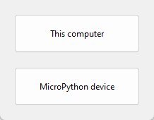

Geef het project een goeie naam: vb. : "Blink_LED" en selecteer de juiste microcontroller board. Het Arduino Framework wordt gebruikt om de Arduino-code te compileren naar binaire code die in de esp32 microcontroller kan worden geprogrammeerd.

Let op de locatie van uw project binnen de mappenstructuur van uw computer. Gebruik hiervoor logische sructuren zodat je later uw projecten kan terug vinden!!

De standaard locatie staat nu ingesteld op het pad : Documents >PlatformIO >Projects 


Klik "Finish".

Er wordt een nieuw project toegevoegd aan de Workspace. Open platformio.ini en voeg toe:

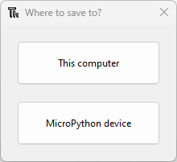

VS Code en PlatformIO hebben een mappenstructuur die verschilt van het standaard .ino-project. Als u op het tabblad Verkenner klikt, ziet u alle bestanden die het heeft gemaakt in uw projectmap. Het lijkt misschien veel bestanden om mee te werken. Maar maak je geen zorgen, meestal hoef je alleen maar met een of twee van die bestanden om te gaan.

:::warning
Let op, je verwijdert, wijzigt of verplaatst best die bestanden niet. Anders kunt u uw project niet meer compileren met PlatformIO.
:::

**platformio.ini file**

Het platformio.ini-bestand is het PlatformIO-configuratiebestand voor uw project. Het toont het platform, het bord en het raamwerk (framework) voor uw project. U kunt ook andere configuraties toevoegen, zoals bibliotheken die moeten worden opgenomen, uploadopties, het wijzigen van de baudrate van de seriële monitor en andere configuraties.

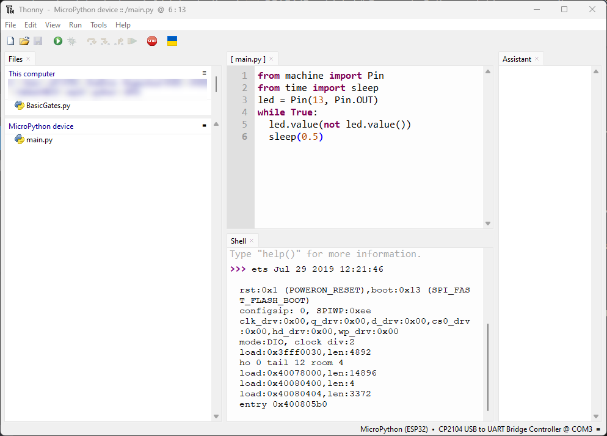

Met volgende:

> * platform: welke gebruikte microcontroller (SoC).
> * board: het type ontwikkel-board
> * framework: het software ontwikkel platform die de code zal compileren

Voor de ESP32 en ESP8266, wordt de gebruikte datasnelheid voor de seriëele communicatie ingesteld op een baud rate van 115200. Dit doe je door de platformio.ini file (zoals volgnde figuur) aan te passen (Klik na aanpassen op Ctrl+S om wijziging op te slaan). In dit bestand kun je ook de identifier opnemen van bibliotheken die je in je project gaat gebruiken met behulp van de lib_deps-richtlijn.

**src folder**

De src-map is uw werkmap. Onder de src-map bevindt zich een main.cpp-bestand. Daar schrijf je je code. Klik op dat bestand. De structuur van een Arduino-programma zou moeten openen met de functies setup() en loop().


In PlatformIO moeten alle Arduino sketches (een project wordt in de Arduino een sketch genoemd) bovenaan in de code straten met het aanroepen van de Arduino bibliotheek door volgend statement **#include <Arduino.h>**.

De src is de afkorting van source (1) en in deze folder staat het eigenlijke programma (3) met de
naam main.cpp (2).

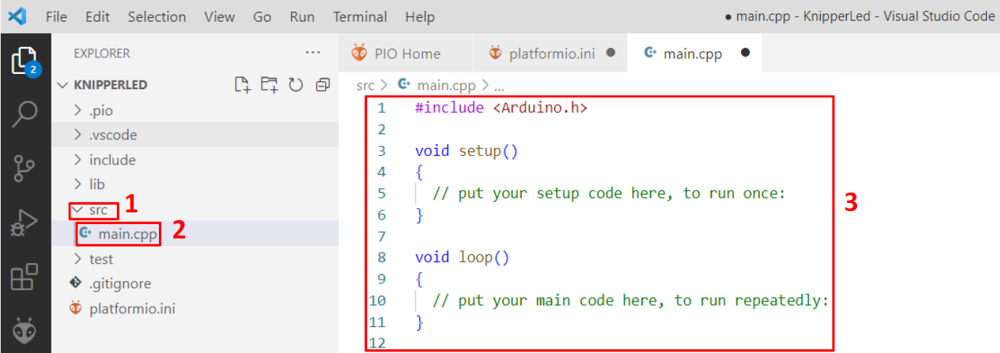

## Het schrijven van een programma.

De code die automatisch gegenereerd wordt ziet er ongeveer uit zoals volgende figuur. De accolade op
lijn 4 staat standaard na ‘setup()’ en de accolade op lijn 9 staat standaard na ‘loop()’. Deze zijn op een
nieuwe lijn geplaatst zodat de structuur van het programma iets duidelijker wordt en pas je best
altijd toe.

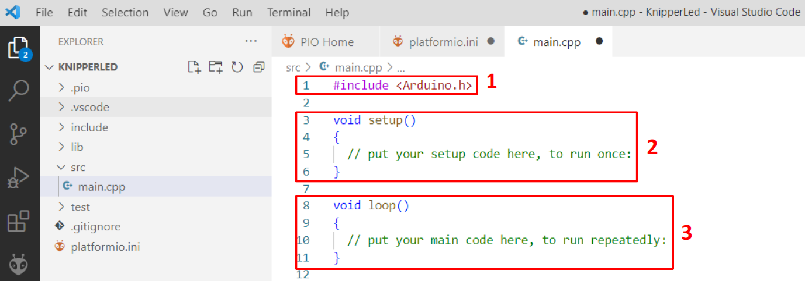

De eerste lijn code (1) is de aanroep van de Arduino bibliotheek. Deze lijn moet altijd bovenaan het programma staan. De volgende twee blokken zijn methoden die altijd in het project moeten staan.
De methode ‘Setup’ (2) wordt altijd direct na het opstarten van de controller aangeroepen en de code tussen de accolades wordt dan uitgevoerd.
Na het beëindigen van de Setup-methode wordt de Loop-methode (3) uitgevoerd. De methode wordt constant herhaald tot dat de spanning van de microcontroller wordt verwijderd.

::: warning
De setup-methode wordt slechts één keer uitgevoerd bij het starten van een programma.<br>De loop-methode wordt constant herhaald. Dit is dus een oneindige iteratie waarbij de voorwaarde altijd True is.
:::


Een methode heeft altijd een naam. Bij de setup-methode is dit de naam ‘setup’ (1).
De beide methodes hebben geen parameters die eraan worden meegegeven. Dit kan je zien omdat er geen tekst tussen de haakjes staat (2).
Een methode kan ook een resultaat teruggeven. Beide methodes geven geen resultaat terug. Dit kan je zien aan het woordje ‘void’ (3). De letterlijke vertaling van void is leegte.
Op lijn 3 staat dus de naam van de methode en de eventuele parameters. De code van de methode staat altijd tussen accolades en wordt de body genoemd (4).
In onderstaande figuur hebben beide methodes nog geen code. Er staat bij beide enkel een dubbel forward slash met daarachter tekst. De tekst is commentaar en doet eigenlijk niets aan het programma. De tekst doet louter dienst als hulp voor de programmeur of anderen die de code gebruiken. De twee forward-slashes geven aan dat de tekst erna gezien wordt als commentaar.

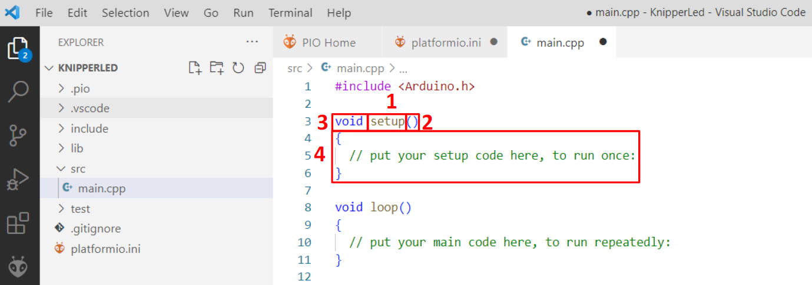


<div style="background-color:darkgreen; text-align:left; vertical-align:left; padding:15px;">
<p style="color:lightgreen; margin:10px">
Vervolledig de code van de setup- en de loop-methode zoals in de Figuur.
Zorg dat de code identiek is als in de figuur omdat bij schrijffouten het programma niet zal werken.
Hou ook rekening met kleine- en hoofdletters want de code is case-sensitief.<br>
Wat de code doet wordt voorlopig niet besproken.
</p>
</div>

```cpp
#include <Arduino.h>

#define LED 13

void setup() {
  // put your setup code here, to run once:
  Serial.begin(115200);
  pinMode(LED, OUTPUT);
}

void loop() {
  // put your main code here, to run repeatedly:
  digitalWrite(LED, HIGH);
  Serial.println("LED is on");
  delay(1000);
  digitalWrite(LED, LOW);
  Serial.println("LED is off");
  delay(1000);
}
```

## Het compileren van een programma

Als het programma volledig is geschreven, kan het gecompileerd worden. Compileren wil zeggen dat
de tekst van het programma wordt omgezet in code die de controller begrijpt.
Om het programma te compileren druk je op de knop ‘PlatformIo’ (1) en vervolgens op ‘Build’ (2). In
het venster (4) zie je het resultaat van het compileren. Als er fouten zijn zoals schrijffouten dan zullen
de errors ook in dit venster staan.
Een andere manier om te compileren is op het buildsymbool (3) te drukken.

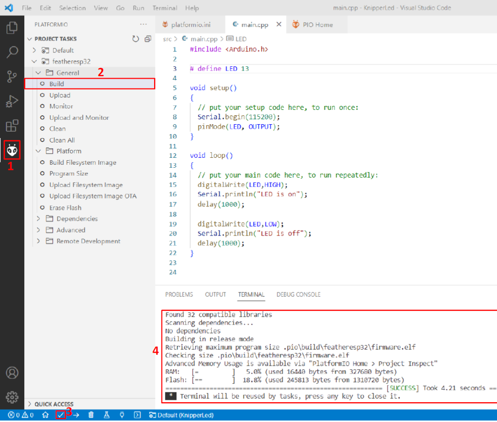

## De hardware van het project

Er staat standaard naast de micro-USB connector een led (1) die verbonden is met IO 13

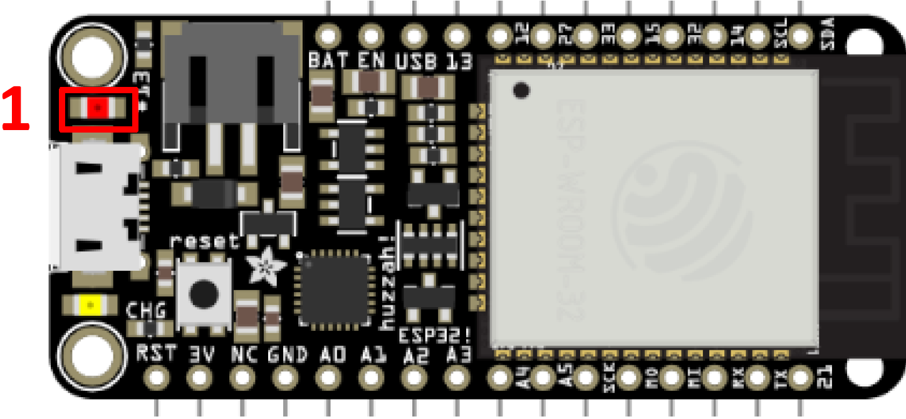

Als de schakeling gebouwd is mag de controller verbonden worden met de laptop of PC waarop
Visual Code draait.
Daarvoor heb je een kabel nodig van USB-A naar USB-micro.

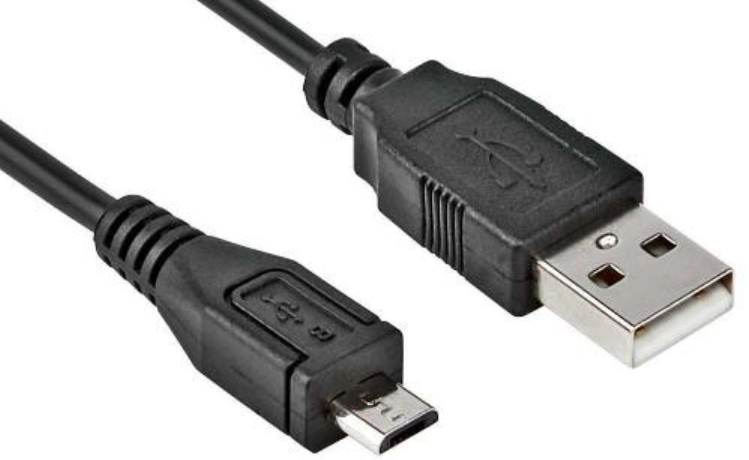


## Uploading Code met PlatformIO IDE: ESP32/ESP8266

Als het ontwikkelbord is aangesloten dan klik je op ‘Upload’ (2). De code wordt gecompileerd en
wordt na het bord gestuurd. Als er niets is fout gelopen zie je succes staan (4) en zie je de led
knipperen.
Een andere manier om de file naar het bord te sturen is om op het pijltje (3) te drukken.

Schrijf volgende code in de main.cpp

```cpp
#include <Arduino.h>

#define LED 13

void setup() {
  // put your setup code here, to run once:
  Serial.begin(115200);
  pinMode(LED, OUTPUT);
}

void loop() {
  // put your main code here, to run repeatedly:
  digitalWrite(LED, HIGH);
  Serial.println("LED is on");
  delay(1000);
  digitalWrite(LED, LOW);
  Serial.println("LED is off");
  delay(1000);
}
```

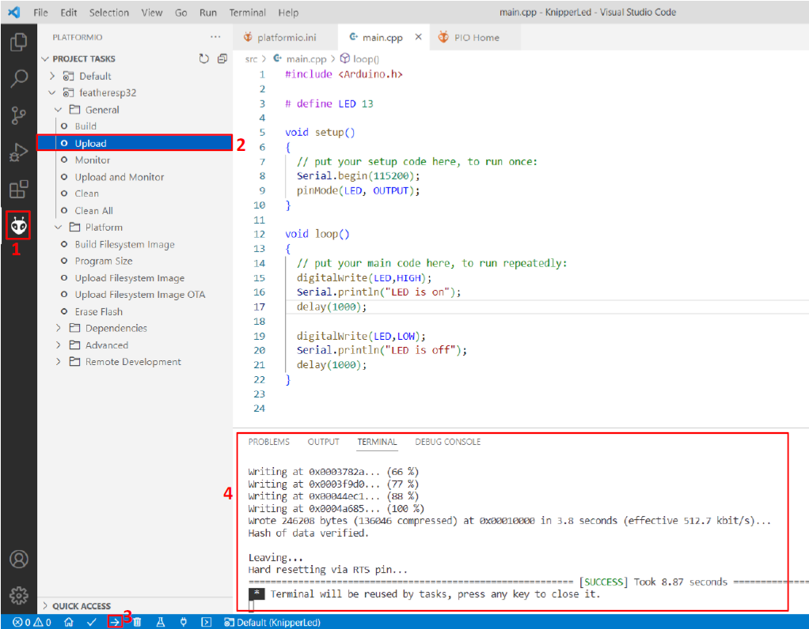

Nu kunt u op het pictogram Uploaden klikken om de code te compileren en te uploaden. U kunt ook naar het menu PIO-projecttaken gaan en Uploaden selecteren.


Als de code successvol is geuploaded, dan wordt volgend bericht weergegeven.


Klik nu op het pictogram van de seriële monitor en u zou de huidige LED-status moeten zien afdrukken.


## De seriële monitor

In het programma wordt de toestand van de led ook serieel weggeschreven. Deze tekst die verstuurd wordt kan je zien in de seriële monitor. Tekst naar de seriële monitor wordt gebruikt om de code te debuggen en te testen. Op regelmatige tijdstippen schrijf je dan bepaalde info naar de monitor om zo te weten waar in de code de processor zit bij het runnen.
Klik op ‘Monitor’ (2) of op het stekkertje (3) om de monitor zichtbaar te maken. De versturude tekst kan je zien in de terminal (4).

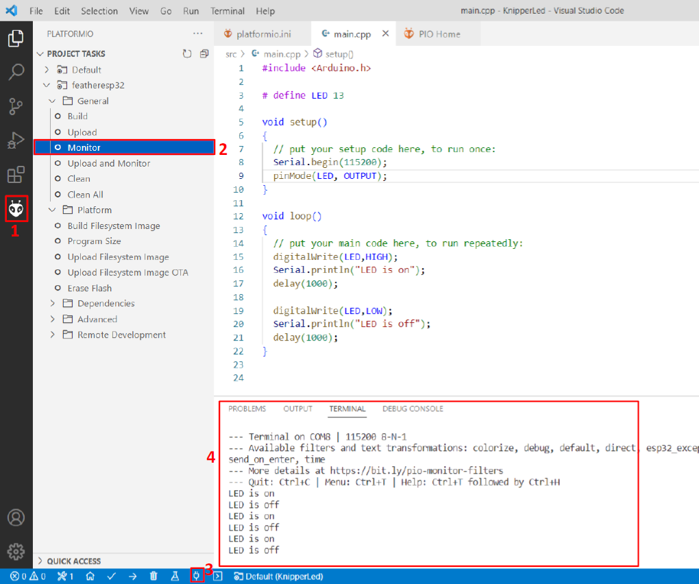

<div style="background-color:darkgreen; text-align:left; vertical-align:left; padding:15px;">
<p style="color:lightgreen; margin:10px">
Opdracht: Maak een nieuw programma en wijzig het programma zodat de led twee maal zo snel knippert dan
het programma ‘KnipperLed’.
</p>
</div>