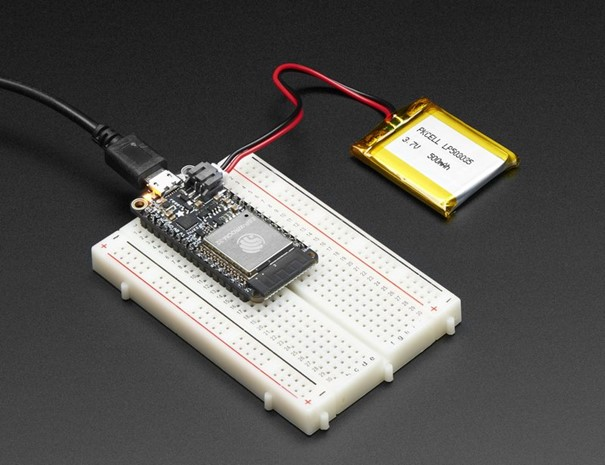

# Power Management

De esp32 kan op verschillende manieren worden voorzien van spanning (voeding). 

## Battery + USB Power

We wilden de Feather HUZZAH32 gemakkelijk van stroom voorzien, zowel bij aansluiting op een computer als via een batterij. Er zijn **twee manieren** om een Feather van stroom te voorzien. U kunt verbinding maken met een micro-USB-kabel (gewoon in de aansluiting steken) en de Feather regelt de 5V USB tot 3,3V met een interne spanningsregelaar. U kunt ook een 4.2/3.7V Lithium Polymer (Lipo/Lipoly) of Lithium Ion (LiIon) batterij aansluiten op de JST jack. Hierdoor werkt de Feather op een oplaadbare batterij. Wanneer de USB-voeding is ingeschakeld, schakelt deze automatisch over naar USB voor voeding en begint de batterij (indien aangesloten) op 200 mA op te laden. Dit gebeurt in 'hot-swap'-stijl, zodat u de LiPoly altijd aangesloten kunt houden als een 'back-up'-stroom die alleen wordt gebruikt als de USB-stroom uitvalt.

::: warning
De polariteit van de JST-connector is afgestemd op Adafruit LiPoly-batterijen. Het gebruik van batterijen met de verkeerde polariteit kan je Feather kapot maken.
:::

Het bovenstaande toont de Micro USB-aansluiting (links), Lipoly JST-aansluiting (linksboven), evenals de 3.3V-regelaar (rechts van de JST-aansluiting), omschakeldiode + transistor (onder de JST-aansluiting) en de Lipoly-oplaadpoort circuit (direct onder de regelaar).

Er is ook een CHG-LED naast de USB-aansluiting, die oplicht terwijl de batterij wordt opgeladen. Deze LED kan ook flikkeren als de batterij niet is aangesloten, dit is normaal.

## Power supplies

Je hebt hier heel wat voedingsopties! We beginnen met de BAT-pin, die is verbonden met de lipoly JST-connector, evenals USB, de +5V van USB indien aangesloten. We hebben ook de 3V-pin die verbonden is met de output van de 3.3V-regelaar. We gebruiken een 500mA piek low-dropout regelaar. Beperk extern stroomverbruik tot 250mA (WROOM32-module consumeert ook 250mA). Hoewel u er in totaal 500 mA uit kunt halen, kunt u dit niet continu doen vanaf 5V, omdat dit de regelaar oververhit. We gebruiken dit om de ESP32 van stroom te voorzien, die continu ongeveer 200 mA trekt. Het goede nieuws is dat je de ESP32 veel gemakkelijker in de slaap- en energiebesparende modus kunt zetten.

## Measuring battery, meten van de batterijspanning

Als je geen batterij meer hebt, is de kans groot dat je wilt weten wat de spanning is! Zo weet je wanneer de batterij moet worden opgeladen. Lipoly-batterijen zijn 'maximaal' bij 4,2 V en blijven ongeveer 3,7 V gedurende een groot deel van de levensduur van de batterij, en zakken dan langzaam naar 3,2 V voordat het beveiligingscircuit het afsnijdt. Door de spanning te meten, kunt u snel zien wanneer de batterij onder de 3,7 V zakt.

Omdat de ESP32 tonnen ADC-pinnen heeft, 'offeren' we er een voor LiPoly-batterijbewaking. Je kunt de helft van de accuspanning aflezen van A13. Vergeet niet de afgelezen spanning te verdubbelen, er is namelijk een deler.

## Enable pin

Als u de 3.3V-regelaar wilt uitschakelen, kunt u dat doen met de EN(able) pin. Bind deze pin eenvoudig aan de grond en het zal de 3V-regelaar uitschakelen. De BAT- en USB-pinnen worden nog steeds van stroom voorzien.
Hierdoor worden de ESP32-processor en alle ingebouwde circuits uitgeschakeld, behalve de USB-seriële converter.

## Alternative Power Options

De twee belangrijkste manieren om het bordje van stroom te voorzien, zijn een LiPo-batterij van 3,7 / 4,2 V die is aangesloten op de JST-poort of een USB-voedingskabel.

Als je andere manieren nodig hebt om het bordje van stroom te voorzien, wordt volgende geadviseerd :

> Voor permanente installaties kunt u met een 5V 1A USB-wandadapter een USB-kabel aansluiten voor betrouwbare stroom
> Gebruik voor mobiel gebruik, waar u geen LiPoly wilt, een USB-batterijpakket!
> Als je een voeding met een hogere spanning hebt, gebruik dan een 5V buck-converter en sluit deze aan op de 5V- en GND-ingang van een USB-kabel

Volgende mag je NIET doen :

> Gebruik geen alkaline- of NiMH-batterijen en sluit deze aan op de batterijpoort - dit zal de LiPoly-oplader vernietigen en er is geen manier om de oplader uit te schakelen
> Gebruik geen 7.4V RC-batterijen op de batterijpoort - dit zal het bord vernietigen

::: warning
De esp32-Feather is niet ontworpen voor externe voedingen - dit is een ontwerpbeslissing om het bord compact en goedkoop te maken. Het wordt niet aanbevolen, maar technisch mogelijk om :
:::

> - Sluit een externe 3.3V voeding aan op de 3V en GND pinnen. Niet aanbevolen, dit kan onverwacht gedrag veroorzaken en de EN-pin werkt niet meer. Dit levert ook geen stroom op BAT of USB en sommige Feathers/Wings gebruiken die pinnen voor hoge stroomverbruiken. Je kunt je Feather uiteindelijk beschadigen.
> - Sluit een externe 5V-voeding aan op de USB- en GND-pinnen. Niet aanbevolen, dit kan onverwacht gedrag veroorzaken bij het aansluiten van de USB-poort, omdat u de USB-poort weer van stroom voorziet, wat uw computer kan verwarren of beschadigen.