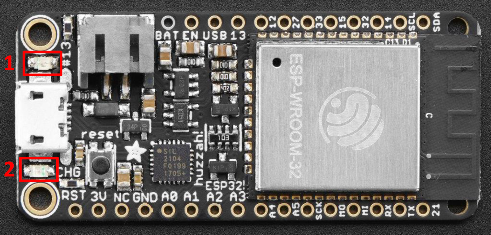

---
mathjax:
  presets: '\def\lr#1#2#3{\left#1#2\right#3}'
---

# GPIO: Output

De esp32 bezit dus een aantal GPIO (General Purpose Input Output) pinnen. Deze pinnen kunnen gebruikt worden als digitale in- of output. Bij een input kan een digitale toestand (0 of 1) worden gelezen door de microcontroller. 


> - Een ingang zal gebruikt worden om door de microcontroller te worden gelezen, hierop zal dus één of andere vorm van sensor of detector worden aangesloten. Meest eenvoudige vorm van zoiets is een drukknop.
> - Een uitgang zal gebruikt worden om door de microcontroller te worden aangestuurd, hierop zal dus één of andere vorm van actuator worden aangesloten. Meest eenvoudige vorm van zoiets is een LED.

## Digitale uitgangen

Een kan dus als een uitgang (output) worden ingesteld in de software. Hierdoor kan de software dan die pin logisch 0 of logisch 1 aansturen. 

> - Wanneer een ouput pin logisch 0 is, dan zal de spanning die op die pin aanwezig is, 0V zijn.
> - Wanneer een ouput pin logisch 1 is, dan zal de spanning die op die pin aanwezig is, 3,3V zijn (= voedingsspanning van de microcontroller).

In digitale systemen worden een aantal termen door elkaar gebruikt om te zeggen dat een toestel **aan** of **uit** staat. Deze verschillende termen worden weergegeven in de volgende tabel.


| 0V | 3,3V |
| ----------- |:------------:|
| Open        | Closed    | 
| Off    | On           | 
| Low  | High   |
| Clear  | Set   |
| Logic 0  | Logic 1   |
| False  | True  |


De termen ‘logisch 0’ en ‘logisch 1’ worden meestal afgekort naar ‘0’ en ‘1’.

## Digitale uitgangspinnen van de EPS32 feather van Adafruit

Wij gebruiken de huzzah32 feather van Adafruit zoals in volgende figuur is weergegeven.


Enkel de pinnen met de gele labels zoals in bovenste figuur kunnen als digitale uitgangen gebruikt worden, behalve pin 34, 39 en 36 niet. Het maximum aantal is dus 18.

***

Het ontwikkelbord heeft 2 leds aanwezig waarbij de led boven de USB-connecter en naast de aansluiting van de battreij verbonden is met IO-pin 13. Deze kunnen we aansturen van uit de code en kan ingesteld worden als uitgang (1).
De led onder de USB-connector (2) knippert vanaf dat er voedingsspanning aanwezig is.



::: warning 
Zorg er altijd voor dat je geen actoren rechtstreeks op een IO-pin van de ESP32 aansluit die een stroom moet sourcen (leveren) die hoger is dan 40mA of een stroom moet sinken (afleiden naar massa) die hoger is dan 20mA.
:::

## pinMode

Als men een IO-pin als uitgang wil gebruiken moet men de pinMode van de IO-pin instellen als uitgang zoals in volgende figuur. Het is het gemakkelijkst om hier de gele pinbenaming te gebruiken zoals in bovenste figuur.
De pinMode van de IO-pin stel je in bij opstart van de controller en dit gebeurt in de setup-methode (instructie moet slechts één keer worden uitgevoerd, vanaf dan weet de µC dat deze pin een OUTPUT is).
Aan de functie *pinMode* worden er twee parameters meegegeven tussen haakjes. De eerste parameter is de IO-pin waarover het gaat en de tweede parameter is hoe deze ingesteld moet worden, hier is dit als uitgang. De instructie wordt afgesloten met een puntkomma.

```cpp
#include <Arduino.h> //bibliotheek nodig voor de pinnamen en ...
void setup()
{
    pinMode(13, OUTPUT);
}
```

Een goede programmeur zal een duidelijker naam willen voor de uitgang en zo weinig mogelijk gebruik maken van de IO-nummers. Daarom gaat men gebruik maken van constanten. De constanten declareert men voor de setup routine in het begin van het programma.
Op lijn 3 is te zien dat de constante de naam ‘LED’ heeft en dat er 13 wordt toegewezen. ‘# define’ geeft weer dat LED gelijk staat aan 13. In de code wordt bij het compileren overal LED vervangen door 13.

```cpp
#include <Arduino.h> //bibliotheek nodig voor de pinnamen en ...
# define LED 13
void setup()
{
    pinMode(LED, OUTPUT);
}
```

## digitalWrite

Een digitale uitgang kan twee waarden aannemen. In de volgende figuur zijn een aantal mogelijkheden om een digitale uitgang een waarde de te geven.
Als de uitgang laag, 0 of als false wordt ingesteld, dan wordt er een 0V spanning op de desbetreffende pin geplaatst (door de inwendige elektronica van de µC).
Als de uitgang hoog, 1 of als true wordt ingesteld dan wordt er een spanning gelijk aan de voedingsspanning op de pin geplaatst. Bij de EPS32 is dit een spanning van 3,3V.
De methode digitalWrite heeft twee parameters die moeten worden meegegeven tussen haakjes. De eerste parameter is de IO-pin waarover het gaat. Hier is dit *LED* die aangesloten is op IO-pin 13. De tweede parameter is de waarde van de uitgang. Bijvoorbeeld LOW, HIGH, … . De instructie wordt afgesloten met een puntkomma.

```cpp
#include <Arduino.h> //bibliotheek nodig voor de pinnamen en ...
# define LED 13
void setup()
{
    pinMode(LED, OUTPUT);
}
void loop()
{
    //Mogelijkheid om een uitgang laag te maken
    digitalWrite(LED, LOW);
    digitalWrite(LED, false);
    digitalWrite(LED, 0);
    //Mogelijkheid om een uitgang hoog te maken
    digitalWrite(LED, HIGH);
    digitalWrite(LED, true);
    digitalWrite(LED, 1);
}
```

Natuurlijk is bovenstaand programma onzinnig omdat er drie keer na elkaar wordt gecommandeerd dat de uitgang LAAG moet worden gezet. Eén keer is voldoende om de uitgang LAAG te zetten, en dit blijft zo tot het anders wordt gecommandeerd.

::: details
Het commando "digitalRead", wat normaal gebruikt wordt bij een digitale input (zie later), kan eigenaardig ook gebruikt worden bij een digitale output. Hierdoor kan volgend programma werken.
:::

```cpp
#include <Arduino.h> //bibliotheek nodig voor de pinnamen en ...
# define LED 13
void setup()
{
    pinMode(LED, OUTPUT);
}
void loop()
{
    digitalWrite(LED, !(digitalRead(LED)));
    delay(1000);
}
```
::: tip
Het uitroepteken wordt bij logische operatoren gebruikt om de digitale toestand te inverteren (0 wordt 1 en/of 1 wordt 0).
:::


***

De meest eenvoudige actuator die kan aangestuurd worden met een digitale ouput pin is een LED.

Een LED is een diode met twee aansluitklemmen (Anode en Kathode). Een  LED zal licht afgeven bij volgende voorwaarden:
> - Anode staat op een positief niveau tov de anode (ongeveer 1,5V) 
> - De stroom die van Anode naar Kathode vloeit is ongeveer 20mA.  

Voor detail bij een specifieke LED, zoek in datasheet van die LED naar Uf en If.

Door deze twee waarden is het noodzakelijk om een weerstand in serie te plaatsen met de LED.

We kunnen een LED extern plaatsen en aansturen door gebruik te maken van een breadboard.

Op een breadboard kan dan via draadjes verbindingen en schakelingen worden gebouwd. 


De doorverbindingen van het breadboard ziet er als volgt uit:


## Aansluiten van een led (hardware)

De meeste standaard leds hebben een werkspanning lager dan 3,3V. Als we de led rechtstreeks aansluiten op de microcontroller zal door de te hoge spanning de stroom door de led te groot worden en zal dit de led beschadigen. In het slechtste geval is de led direct defect.
Als de stroom groter zal zijn dan 40mA bij de ESP32, dan zal de uitgang van de controller ook beschadigd worden.

Het schema is te zien in de volgende figuur. In het schema wordt er een weerstand gebruikt van 220Ω.
Gemiddeld staat er over een rode led een spanning van ongeveer 1,6V. Dits wil zeggen dat er over de weerstand een spanning staat van:

Euler's identity $e^{i\pi}+1=0$ is a beautiful formula in $\mathbb{R}^2$.

$U_R=Voedingsspanning-U_{LED}=3,3V-1,6V=1,7V$

De stroom door de weerstand is dan:
$I = \frac{U_R} {R} = \frac{1,7V} {220\Omega}=7,72mA$

De stroom is kleiner dan de 40mA en geeft voldoende licht als de stroom 7,72mA is


In de vorige figuur is een led verbonden met het ontwikkelbord door gebruik te maken van een breadbord, en een serieweerstand van 220Ω en enkele draadjes.
De voedingsspanning en de GND heeft men bij vele schema’s veel nodig en daarom gaan we de voedingsspanning 3,3V verbinden met de rode draad met het breadbord dat gebruikt wordt voor de voedingsspanning. De GND wordt met de zwarte draad verbonden met het breadbord met het deel dat gebruikt wordt voor de GND.
IO-pin 21 wordt verbonden met de weerstand van 220Ω. Aan de andere aansluiting van de weerstand wordt de Anode van de led verbonden. De anode is de langste aansluiting. De kathode wordt verbonden met de GND.

## Het programma (software)

Op de lijnen 1 t.e.m. 3 wordt er blokcomentaar gegeven wat het programma doet. Blokcommentaar is commentaar over meerdere lijnen en is enkel ter verduidelijking van het programma voor de programmeur of gebruiker van de code. Deze code doet niets aan het werkelijke programma.
Ieder programma moet de Arduino bibliotheek includen zoals op lijn 4.

Op lijn 6 wordt er een constante LED gedefinieerd met de waarde 21. Bij het compileren van het programma wordt overal in het programma LED vervangen door 21. Het getal 21 geeft de pinnummer aan waarop de led is aangesloten. Dit wordt gedaan omdat een naam gemakkelijker te onthouden is dan een nummer.

Na het opstarten wordt de setup-routine één keer uitgevoerd. In deze routine worden alle instellingen gedaan.
Op lijn 10 wordt de initialisatie van de communicatie met de seliële monitor gedaan en wordt de snelheid vastgelegd op 115200 bits per seconde. Een instructie wordt altijd afgesloten met een puntkomma.

Op lijn 11 wordt de IO-pin waarop de led is aangesloten ingesteld als een uitgang.
De loop-methode wordt voortdurend uitgevoerd, startend bij lijn 16 t.e.m. lijn 21 en dan terug van lijn 16, … . 
De loop-methode wordt in een oneindige lus uitgevoerd. Op lijn 16 wordt de IO-pin waar de led op is aangesloten hoog gemaakt. Omdat de IO-pinnen werken op een spanning van 3,3V wil dit zeggen dat er een spanning op de uitgang wordt gezet van 3,3V en dat de led gaat branden.
Op lijn 17 en lijn 20 wordt er de nodige commentaar naar de seriële monitor gestuurd. De seriële monitor heeft de naam ‘Serial’. Na Serial komt een punt te staan gevolgd door println. Dit wil zeggen dat de methode println wordt uitgevoerd. Println stuurt tekst naar de seriële monitor en plaatst de cursor op het einde op een nieuwe lijn. Wat er wordt verstuurd, wordt tussen haakjes geplaatst. In het programma wordt er enkel tekst verstuurd. Tekst wordt altijd tussen dubbele quotes geplaatst.

Op lijn 18 en 21 wordt de controller 500ms gepauzeerd. De controller pauzeren gebeurt met de methode ‘delay’. Aan de methode wordt 1 parameter meegegeven en is de waarce die gepauzeerd moet worden in milliseconden. Zoals bij iedere instructie wordt deze afgesloten met een punt-comma.

Op lijn 19 wordt de LED gedoofd.
Door het programma voortdurend na elkaar uit te voeren zal de led voortduren 500ms branden en 500ms doven. Dit zal onze ogen ervaren als het knipperen van de led.

```cpp
/* Het programma laat een LED die op de ESP32 Adafruit Feather is aangesloten op IO-21 knipperen met een frequentie van 1Hz.
*/
#include <Arduino.h> //bibliotheek nodig voor de pinnamen en ...
# define LED 21
void setup() //Methode die 1 keer wordt uitgevoerd
{
    serial.begin(115200); //Initialisatie en de snelheid van de communicatie met de seriële monitor.
    pinMode(LED, OUTPUT); //Instellen dat de IO-pin, waar de LED mee is verbonden, een uitgang is.
}
void loop() //Methode met oneindige herhaling.
{
    digitalWrite(LED, HIGH); //De LED laten oplichten.
    Serial.println("De LED licht op."); //Info naar de seriële monitor sturen.
    delay(500); // De µC 500ms laten wachten.
    digitalWrite(LED, LOW); //De LED laten doven.
    Serial.println("De LED licht op."); //Info naar de seriële monitor sturen.
    delay(500); // De µC 500ms laten wachten.
}
```
<div style="background-color:darkgreen; text-align:left; vertical-align:left; padding:15px;">
<p style="color:lightgreen; margin:10px">
Opdracht: Maak een programma om een rode en groene led extern aan te sturen. Sluit de rode led aan op IO16 en de groene led op IO17. De rode led heeft een voedingsspanning nodig van ongeveer 1,6V en de groene led een spanning van 2V. Beide verbruiken een stroom van 10mA. Bereken de twee Rv's. <br>
Beide leds moeten alternerend knipperen waarbij de periode gelijk is aan 1 seconde. Dit wil zeggen als de rode led brandt, dat de groene led niet brandt en omgekeerd. De leds zijn in de periode van 1 seconde even lang aan als uit (= duty cycle = 50%).<br>
Teken het schema, schrijf het programma (met commentaar), test en toon aan de docent.<br>
</p>
</div>

***

<div style="background-color:darkgreen; text-align:left; vertical-align:left; padding:15px;">
<p style="color:lightgreen; margin:10px">
Opdracht: Maak een verkeerslicht.
</p>
</div>

***


