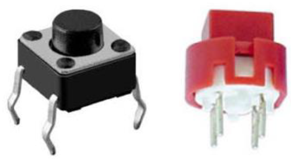
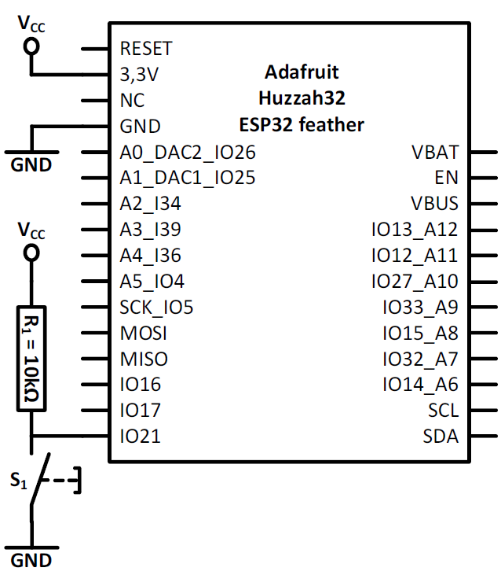
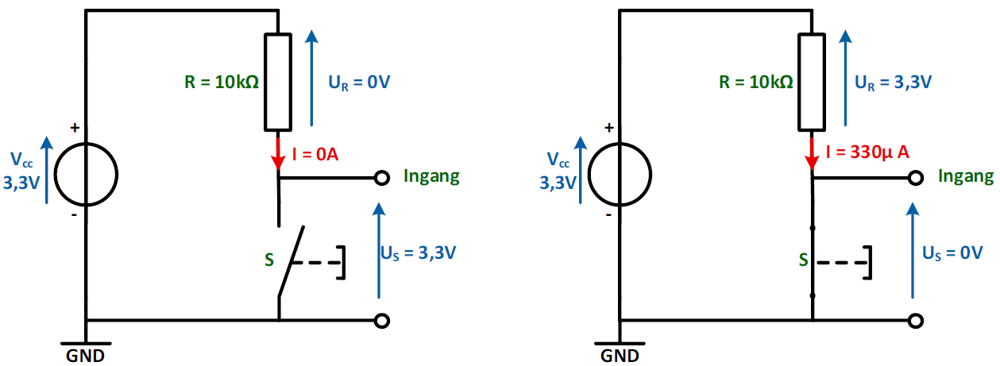
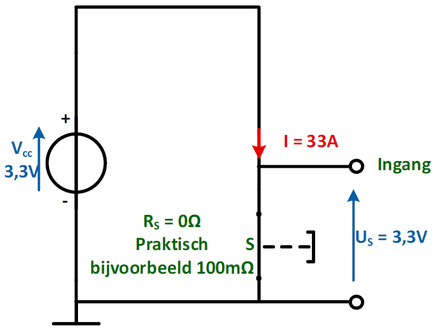
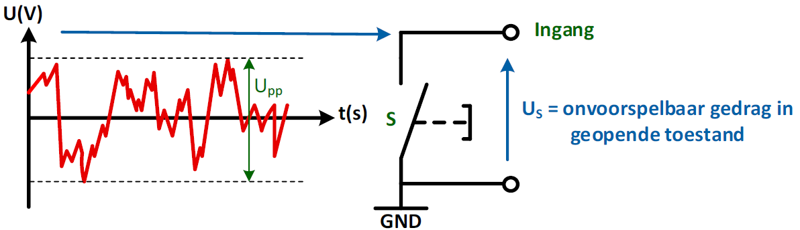
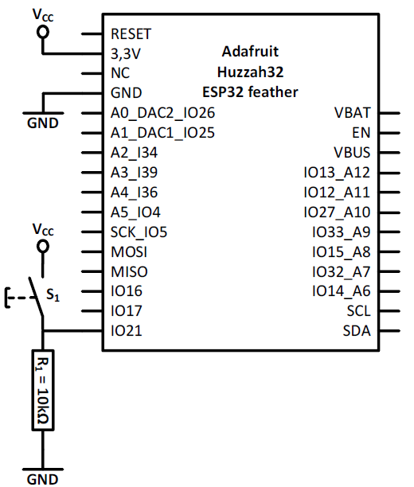
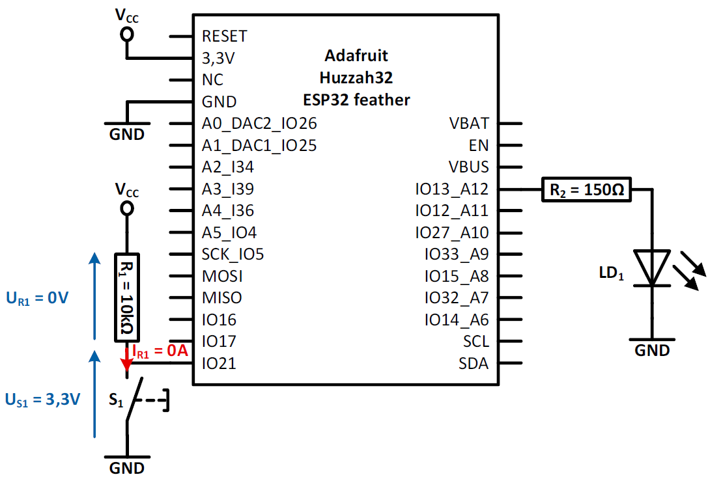
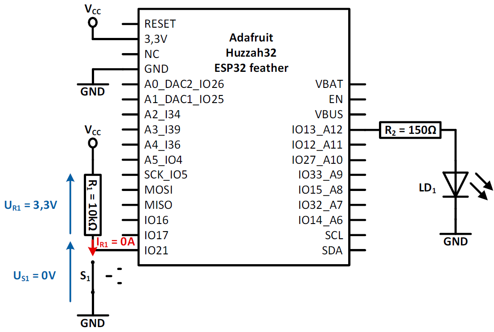

---
mathjax:
  presets: '\def\lr#1#2#3{\left#1#2\right#3}'
---

# GPIO: Input

De esp32 bezit dus een aantal GPIO (General Purpose Input Output) pinnen. Deze pinnen kunnen gebruikt worden als digitale in- of output. Bij een input kan een digitale toestand (0 of 1) worden gelezen door de microcontroller. 


> - Een ingang zal gebruikt worden om door de microcontroller te worden gelezen, hierop zal dus één of andere vorm van sensor of detector worden aangesloten. Meest eenvoudige vorm van zoiets is een drukknop.
> - Een uitgang zal gebruikt worden om door de microcontroller te worden aangestuurd, hierop zal dus één of andere vorm van actuator worden aangesloten. Meest eenvoudige vorm van zoiets is een LED.

## Digitale ingangen

> - Een logische 0 wordt op een digitale input gelezen als er op die pin een spanning wordt aangeboden van 0V.
> - Een logische 1 wordt op een digitale input gelezen als er op die pin een spanning wordt aangeboden van 3,3V (= voedingsspanning van de microcontroller)

De ESP32 gebruikt een voedingsspanning van 3,3V waarbij 0V overeenkomt met ‘off’ (=uit) en 3,3V staat voor ‘on’ (=aan).

In digitale systemen worden een aantal termen door elkaar gebruikt om te zeggen dat een toestel aan of uit staat. Deze verschillende termen worden weergegeven in volgende tabel.


| 0V | 3,3V |
| ----------- |:------------:|
| Open        | Closed    | 
| Off    | On           | 
| Low  | High   |
| Clear  | Set   |
| Logic 0  | Logic 1   |
| False  | True  |

De termen ‘logisch 0’ en ‘logisch 1’ worden meestal afgekort naar ‘0’ en ‘1’.


Enkel de pinnen met de gele labels zoals in Figuur 218 kunnen als digitale ingangen gebruikt worden. Behalve pin 12 is niet aan te raden om te gebruiken als ingang omdat deze standaard is voorzien van een pull-down weerstand en deze mag bij het booten (=opstarten) niet beïnvloed worden. Het maximum aantal is dus 20.

## Aansluiten van sensoren (bv drukknoppen) met een pullup weerstand

Aan een digitale ingang kunnen we detectoren aansluiten die aan de microcontroller doorgeven of er een spanning aanwezig is of niet.
Een voorbeeld van een detector die een digitale waarde geeft is een drukknop.



De eenvoudigste hardware detector die kan gebruikt worden om een digitale input aan te sturen is een drukknop. Bedienen kan door het indrukken of het loslaten van de drukknop. Een drukknop is geen schakelaar. Een schakelaar kent twee rusttoestanden, een drukknop slechts één.

Een drukknop werkt op het principe van het 'maken van een contact' of 'het verbreken van een contact tussen twee aansluitpunten. Soms spreekt men van een NO-contact of een NC-contact. Meestal wordt als drukknop een NO-contact gebruikt. Bij het drukken worden een verbinding gemaakt, bij loslaten wordt een verbinding verbroken, tussen twee aansluitpunten.

Het schema om een drukknop aan te sluiten aan een microcontroller met een pull-up weerstand is weergegeven in de volgende figuur.



Als je naar het schema kijkt wordt er niet alleen een drukknop gebruikt maar ook een weerstand.
Deze weerstand noemt een pull-up weerstand omdat hij de ingang aan de voedingsspanning hangt als de drukknop niet is ingedrukt. Bij het indrukken wordt de ingang aan de GND verbonden.

## Werking van het schema.

De drukknop heeft twee toestanden. Als hij niet ingedrukt is leest de ingang een hoge spanning. Linkse afbeelding de volgende figuur. De microcontroller zal dit zien als een logische 1 of true.

$I = 0 A$

Als de knop ingedrukt is leest de ingang een lage spanning. Rechtse afbeelding in de volgende figuur.
De microcontroller zal dit zien als een logische 0 of false.

$I = \frac{U_R} {R} = \frac{3,3V} {10k\Omega}=0,033mA = 330\mu A$

Dit is een digitale detector omdat de drukknop maar twee toestanden kan weergeven, namelijk ingedrukt, uit, laag of 0. De andere toestand is niet ingedrukt, aan, hoog of 1.



De reden voor de weerstand R is om geen kortsluiting te veroorzaken als de drukknop gesloten is. Als de weerstand er niet zou zijn en de schakelaar is gesloten dan hebben we de schakeling van volgende figuur.



$I = \frac{U_R} {R} = \frac{3,3V} {100m\Omega }=33A$

Zonder weerstand met een gesloten drukknop loopt er een stroom van 33A. 33A is te groot voor de voeding waardoor de voeding defect zal geraken. De draden die de verbinden verzorgen naar de componenten zijn ook veel te dun. Met een stroom van 33A zal de temperatuur van de draden stijgen met als gevolg dat de isolatie en het koper zal smelten.

Een tweede reden waarom er een weerstand gebruikt wordt is omdat in beide schakelstanden de ingang aan een vast potentiaal zal hangen (0V of 3,3V). Een ingang waaraan geen pull-up gebruikt wordt zal in geopende stand een antenne vormen. Dit wil zeggen dat door storingen de microcontroller een hoge of een lage spanning kan zien wat een ongewenst gedrag van de microcontroller als gevolg heeft.



Samengevat krijgen we deze opstellingen met pull-up weerstanden. Uitzonderlijk kunnen ook pull-down weerstanden gebruikt worden.


::: warning
Een pull-up weerstand wordt het meest gebruikt. Het nadeel is dat men een 1 krijgt als de drukknop niet is ingedrukt en een 0 als de drukknop is ingedrukt. Je kan dit zien als een NEGATIEVE LOGICA of een ACTIEF LAGE manier om een drukknop te gebruiken.
:::

## Aansluiten van sensoren (bv drukknoppen) met een pulldown weerstand

Het schema om een drukknop aan te sluiten aan een microcontroller met een pull-down weerstand is weergegeven in de volgende figuur.



Als je naar het schema kijkt wordt er niet alleen een drukknop gebruikt maar ook een weerstand. Deze weerstand noemt een pull-down weerstand omdat hij de ingang aan 0V verbindt als de drukknop niet is ingedrukt.

## pinMode

Als men een IO-pin als ingang wil gebruiken moet men de pinMode van de IO-pin instellen als ingang zoals in vorige figuren. Het is het gemakkelijkst om hier de gele pinbenaming te gebruiken.
De pinMode van de IO-pin stel je in bij opstart van de controller en dit gebeurt in de setup-methode.
Aan de methode pinMode worden er twee parameters meegegeven tussen haakjes. De eerste parameter is de IO-pin waarover het gaat en de tweede parameter is hoe deze ingesteld moet worden, hier is dit als ingang. De instructie wordt afgesloten met een puntkomma.

```cpp
#include <Arduino.h> //bibliotheek nodig voor de pinnamen en ...
void setup()
{
    pinMode(21, INPUT);
}
```

Een goede programmeur zal een duidelijker naam willen voor de uitgang en zo weinig mogelijk gebruik maken van de IO-nummers. Daarom gaat men gebruik maken van constanten. De constanten
declareert men voor de setup routine in het begin van het programma.
Op lijn 3 is te zien dat de constante de naam ‘DRUKKNOP’ heeft en dat er 21 wordt toegewezen. ‘# define’ geeft weer dat DRUKKNOP gelijk staat aan 13. In de code wordt bij het compileren overal DRUKKNOP vervangen door 21.

```cpp
#include <Arduino.h> //bibliotheek nodig voor de pinnamen en ...
#define DRUKKNOP 21
void setup()
{
    pinMode(DRUKKNOP, INPUT);
}
```

## digitalRead

Als je de toestand van een ingang wil weten, dan kan je de waarde bekomen door gebruik te maken van digitalRead.
Hoe je dit kan doen is in de volgende code weergegeven.
Om een waarde te lezen van een uitgang wordt deze bewaard in een variabele die gedeclareerd is op lijn 8.
Het lezen van de waarde gebeurt op lijn 9. Dit wordt gedaan met de methode **digitalRead**. Aan de methode wordt de IO-pin waarvan de waarde moet gelezen worden meegegeven. Hier is dit DRUKKNOP en deze is aangesloten op pin 21. Deze methode geeft na uitvoeren een waarde terug. De teruggeven waarde wordt in de variabele intStatusDrukknop geplaatst. De instructie wordt afgesloten met een puntkomma.

```cpp
#include <Arduino.h> //bibliotheek nodig voor de pinnamen en ...
#define DRUKKNOP 21 //naam DRUKKNOP verwijst naar 21
void setup()
{
    pinMode(DRUKKNOP, INPUT); //DRUKKNOP instellen als ingang
    uint8_t intStatusDrukknop; //Declaratie van variabele met 
                                //naam en type: unsigned 8 bit integer 
    intStatusDrukknop = digitalRead(DRUKKNOP); //Inlezen status DRUKKNOP en toestand wegschrijven in variabele
}
```

## Voorbeeldprogramma digitale ingang

Een voorbeeld om een ingang in te lezen en afhankelijk van de toestand van de drukknop die we verbinden met een digitale ingang zoals volgende code. Als de drukknop is ingedrukt laten we een LED op pin 13 branden. Als de drukknop niet is ingedrukt laten we hem doven.


In het rode kader (1) lezen we de toestand van de digitale ingang die we bij de declaratie hebben ingesteld en die we de naam DRUKKNOP hebben gegeven. Direct in dezelfde lijn controleren we de gelezen waarde als die logisch 0 is.

Als ‘drukknop’ logisch 1 is, staat er een spanning van 3,3V op de ingang en dit komt overeen met een drukknop die niet ingedrukt is omdat we gebruik maken van een drukknop die verbonden is via een pull-up weerstand met de ingang zoals weergegeven in volgende figuur.



Als de drukknop niet is ingedrukt wordt de led laag gezet door een logisch 0 te sturen waardoor hij niet brandt. Dit is de code in blok (2) van Figuur 233 die wordt uitgevoerd.
Als de drukknop logisch 0 is, staat er een spanning van 0V op de ingang en dit komt overeen met een drukknop die ingedrukt is omdat we gebruik maken van een drukknop die verbonden is via een pullup weerstand met de ingang zoals weergegeven in volgende figuur.



Als de drukknop is ingedrukt wordt de led hoog gezet door een logisch 1 te sturen waardoor hij gaat branden. Dit is de code in blok (3) van vorige code die wordt uitgevoerd.

::: tip
De ESP32 bezit ook inwendig pull-up en pull-down weerstanden. Deze kunnen geactiveerd worden door pinMode(ingang, INPUT_PULLUP); Dit kan ook met PULLDOWN. Dan moet er uitwendig geen weerstand meer worden geplaatst.
:::

***

::: warning
In de labo's wordt altijd met een externe pullup weerstand gewerkt!!.
:::

***

<div style="background-color:darkgreen; text-align:left; vertical-align:left; padding:15px;">
<p style="color:green; margin:10px">
Opdracht: Digitale ingang blokgolf.
<ul>
<li>Als de drukknop niet is ingedrukt moet er een blokgolfspanning op een uitgang gegenereerd worden met een periode van 50Hz met een duty cycle van 50% (Ton = Toff).</li>
<li>Als de drukknop is ingedrukt moet er een blokgolfspanning op een uitgang gegenereerd worden met een periode van 100Hz met een duty cycle van 50% (Ton = Toff).</li>
</ul>
Visualiseer het resultaat met een oscilloscoop. Leg de werking uit van de oscilloscoop. Verklaar duidelijk wat Volt/div en Time/div is op basis van uw signalen. Zoek op wat duty cycle is en verklaar.
</p>
</div>

***

<div style="background-color:darkgreen; text-align:left; vertical-align:left; padding:15px;">
<p style="color:green; margin:10px">
Opdracht: Digitale ingang tellen.
<ul>
<li>Maak een systeem waarbij je het aantal keer telt dat de drukknop is ingedrukt.</li>
<li>Als de drukknop 10 keer is ingedrukt moet er een led op een uitgang gaan branden.</li>
</ul>
Bij de elfde keer drukken gaat de LED weer uit en begint alles opnieuw, 10 keer LED 1 keer aan, .... Leg duidelijk uit hoe een flankdetectie werkt en wat dender is!
</p>
</div>


