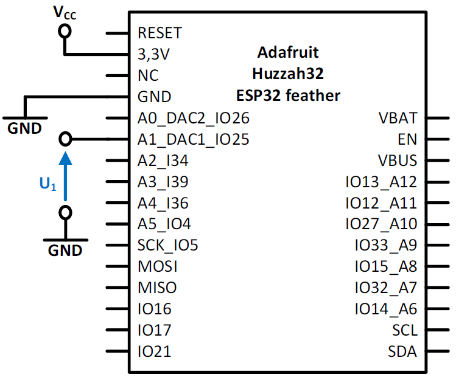
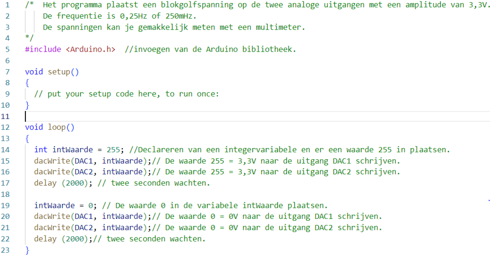
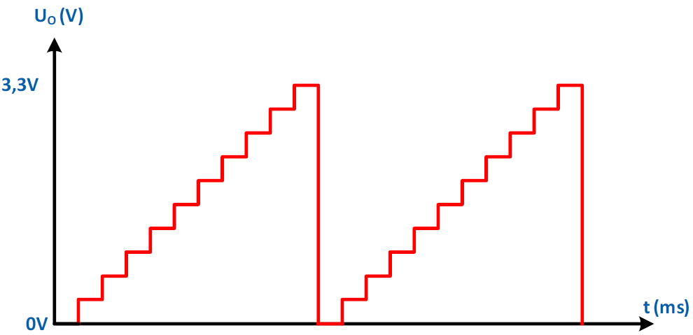
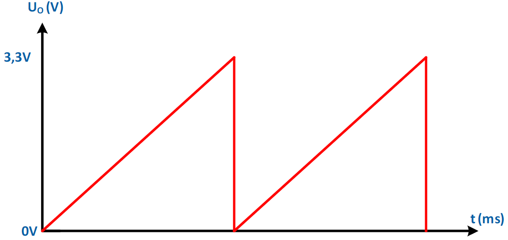
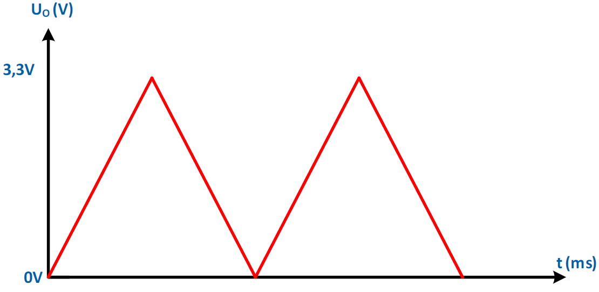

---
mathjax:
  presets: '\def\lr#1#2#3{\left#1#2\right#3}'
---

# Analoge uitgangen

In dit hoofdstuk wordt uitgelegd hoe een analoge uitgang moet aangesloten worden bij de Adfruit Huzah32 feather.

## Analoge uitgangspinnen van de ESP32 feather van Adafruit

Wij gebruiken de huzzah32 feather van Adafruit zoals in volgende figuren is weergegeven.


Het bord heeft twee analoge uitgangspinnen, namelijk DAC1 en DAC2.

## Principe en werking van een DAC

We kunnen de digitaal-naar-analoog-converter (DAC) als een blokschema weergeven met een
digitale ingang D, en een analoge uitgang UO zoals in volgende figuur.

.")

Het uitgangsbereik van de DAC, Vr , is het verschil tussen de Referentie spanning Vref en de minimum spanning die gelijk is aan 0V.

$$V_r = V_{ref} - 0V = V_{ref}$$

Het specifieke uitgangsbereik wordt meestal gedefinieerd door een vaste spanningsreferentie die aan de DAC wordt aangesloten en zal meestal de voedingsspanning zijn.
Digitale controlelijnen maken het mogelijk een microcontroller in te stellen en te communiceren met de DAC en zijn dezelfde als bij een ADC.
De ESP32 heeft een 8bit DAC (d.w.z. n=8) en gebruikt de voedingsspanning van 3,3V als referentiespanning.
Er zullen dus 2<sup>n</sup> stappen in de DAC-uitgangskarakteristiek zijn, namelijk 256.
De stapgrootte, of resolutie, is daarom 12,89mV per bit.

$$\frac{V_{ref}} {2^n} = \frac{3,3V} {2^8} = \frac{3,3V} {256} = 12,89mV$$

De maximale afwijking is 6,45 mV.

$$\frac{Stapgrootte} {2} = \frac{12,89mV} {2} = 6,45mV$$

Voor elke digitale waarde-invoer naar de DAC, er is een bijhorende analoge uitgangswaarde die berekend wordt met de formule:

$$Uo = V_{ref}\frac{D} {2^n}$$

Voor de ESP32 controller is dit: 

$$Uo = 3,3V.\frac{D} {2^8}=3,3V.\frac{D} {256} = 12,89mV.D$$

## dacWrite

Bij de analoge uitgang moet er geen IO-pin ingesteld worden. Er moet enkel gebruik gemaakt worden van de methode dacWrite waaraan je twee parameters moet aan meegeven.
De eerste parameter is welke uitgangspin je wil gebruiken. Dit kan DAC1 of DAC2 zijn.
De tweede parameter is de spanning die je er op wil plaatsen. Dit is een getal tussen 0 en 255. 0 komt overeen met 0V en 255 met 3,3V.
In de volgende code wordt de waarde 255 wat overeenkomt met 3,3V op de analoge uitgang DAC1 geplaatst.

```cpp
void loop()
{
  dacWrite(DAC1, 255);
}
```

## Hardware

Het schema van de analoge uitgang is hier weergegeven. Tussen de uitgang en de GND meet je de analoge spanning of kan je de spanning verder gebruiken. hiervoor gebruik je best een oscilloscoop.



## Software

Het programma plaatst een blokgolfspanning op de twee analoge uitgangen van het bord. De amplitude is 3,3V en de frequentie is 250mHz.
Op lijn 14 wordt er een integer-variabele gedeclareerd en wordt er de waarde 255 aan toegekend. 255 staat voor de maximum spanning en is hier 3,3V (=voedingsspanning).
Op lijn 15 wordt de variabele met de waarde 255 naar de analoge uitgang 1 geschreven.
Op lijn 16 wordt de variabele met de waarde 255 naar de analoge uitgang 2 geschreven.
Op lijn 17 wordt er twee seconden gewacht. Dit wil zeggen dat er twee seconden wordt gewacht voordat er een wijziging gebeurt aan de analoge uitgangen.
Op lijn 19 wordt de variabele intWaarde gevuld met 0 wat overeenkomt met 0V.
Op lijn 20 en 21 wordt de 0V op de twee analoge uitgangen geplaatst.
Op lijn 22 wordt er terug twee seconden gewacht.
De loop methode wordt in een oneindige lus uitgevoerd en na lijn 22 wordt er terug gestart met lijn 14.



***
<div style="background-color:darkgreen; text-align:left; vertical-align:left; padding:15px;">
<p style="color:lightgreen; margin:10px">
Opdracht: Maak een programma waarbij de spanning op de analoge uitgang DAC2 de golfvorm krijgt zoals hieronder afgebeeld met een frequentie van 100Hz.
</p>
</div>




***

<div style="background-color:darkgreen; text-align:left; vertical-align:left; padding:15px;">
<p style="color:lightgreen; margin:10px">
Opdracht: Maak een programma waarbij de spanning op de analoge uitgang DAC2 de golfvorm krijgt zoals hieronder afgebeeld met een frequentie van 100Hz.
</p>
</div>




***

<div style="background-color:darkgreen; text-align:left; vertical-align:left; padding:15px;">
<p style="color:lightgreen; margin:10px">
Opdracht: Maak een programma waarbij de spanning op de analoge uitgang DAC2 de golfvorm krijgt zoals hieronder afgebeeld met een frequentie van 100Hz.
</p>
</div>




***


