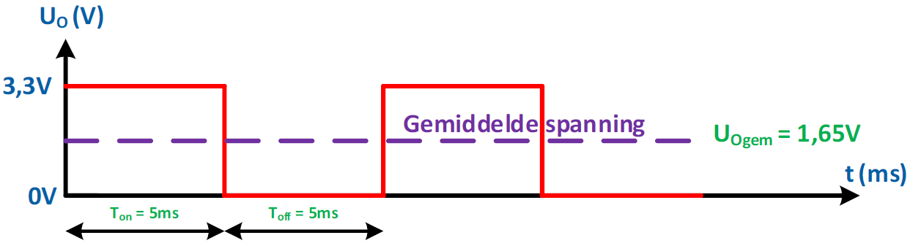
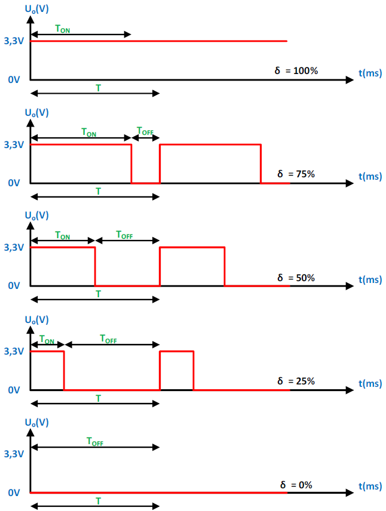

---
mathjax:
  presets: '\def\lr#1#2#3{\left#1#2\right#3}'
---

# Werking

PWM is de afkorting van Pulse With Modulation. In het Nederlands heet dit Puls breedte modulatie of beter puls breedte sturing.

Puls breedte modulatie is een eenvoudige methode om op een digitale uitgang een blokgolfspanning te voorzien om zo een semi-analoge spanning op de uitgang te krijgen.

In de volgende figuur wordt de helft van de tijd de uitgang hoog gemaakt en de andere helft van de tijd de uitgang laag. Dit wil zeggen dat de gemiddelde spanning op de uitgang gelijk wordt aan de helft van de voedingsspanning. In Figuur 262 is dit de helft van 3,3V gelijk aan 1,65V.

::: tip
Merk op dat de frequentie van dit signaal 100Hz is, want de periode is 10ms.
:::

Door de frequentie van de blokgolfspanning groot te nemen wordt dit bij het aansturen van verlichting door het menselijk oog niet gezien als een knipperende verlichting maar als een gedimde verlichting. Bij motoren zal dit ook niet leiden tot een schokkerig draaien maar als het trager draaien van de motor.

::: warning
Bij het gebruik van een PWM signaal zal de frequentie altijd constant blijven!!
:::

Men noemt de duty-cycle de verhouding van de aan-tijd van het signaal ten opzichte van de volledige tijd van de periode, uitgedrukt in procent.

$$\delta = \frac{T_{on}} {T}.100\%$$

Als je de duty-cycle vermenigvuldigd met de voedingsspanning dan bekom je de gemiddelde uitgangsspanning.

$$Uo_{gem} = \delta.Uv$$

PWM-besturing wordt gebruikt in een verscheidenheid aan toepassingen, variërend van communicatie tot automatische besturing. Het dimmen van ledverlichting tot het toerental regelen van een DC-motor, … .

De periode (=T) wordt normaal gesproken constant gehouden, en de puls breedte, of "aan" tijd (=Ton) wordt gevarieerd.

In volgende figuur zijn enkele voorbeelden van PWM-signalen getoond.

