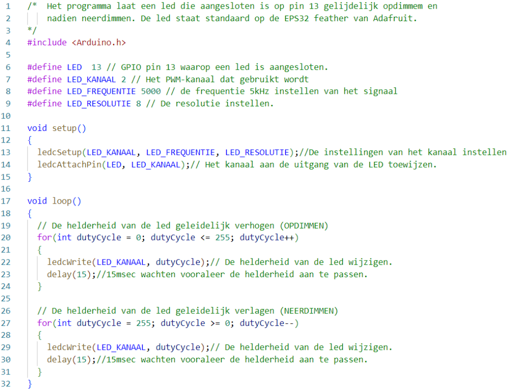

---
mathjax:
  presets: '\def\lr#1#2#3{\left#1#2\right#3}'
---

# PWM voorbeeld dimmen van een LED

Het voorbeeldprogramma laat een led geleidelijk opdimmen en nadien neerdimmen en dit in een oneindige lus.
De lijnen 1 tot en met drie geven meer info over het programma.
Op de lijnen 5 tot en met 9 worden allerlei constanten weergegeven die verder in het programma worden gebruikt.
De setup methode maakt alle instellingen van het PWM kanaal en wijst het kanaal toe aan een uitgangspin.
In de loopmethode wordt er een for-lus voorzien die de duty-cycle geleidelijk verhoogt op lijn 19 t.e.m. 24 en op lijn 26 t.e.m. 31 wordt de for-lus voorzien die de led laat neerdimmen.

