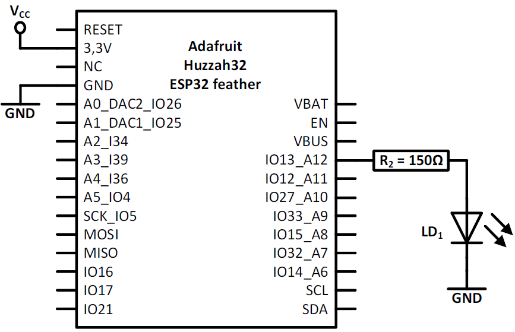
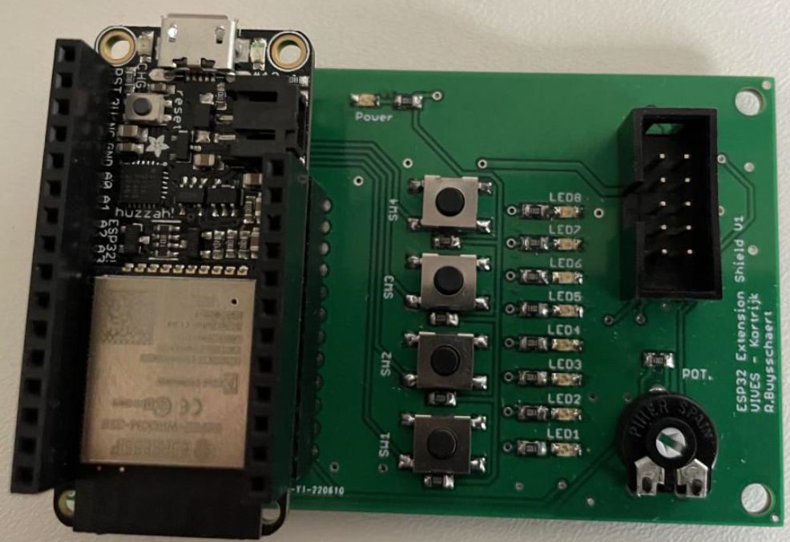

---
mathjax:
  presets: '\def\lr#1#2#3{\left#1#2\right#3}'
---

# PWM hardware en opdrachten

Het schema van de PWM-uitgang is weergegeven en is dezelfde om een LED digitaal aan te sturen, met die uitzondering dat hier de LED dimbaar is.

***

Opdracht1: Vier drukknoppen die een PWM-uitgang besturen. Maak een programma waarbij de helderheid van de LED7 op de shield gedimd kan worden.

<ul>
<li style="color:white">Als op SW1 gedrukt wordt moet de led uit gaan.</li>
<li style="color:white">Als op SW2 gedrukt wordt moet de led op 33% van zijn volle lichtsterkte branden.</li>
<li style="color:white">Als op SW3 gedrukt wordt moet de led op 66% van zijn volle lichtsterkte branden.</li>
<li style="color:white">Als op SW4 gedrukt wordt moet de led op 100% van zijn volle lichtsterkte branden.</li>
</ul>

Gebruik bij het dimmen een periode T van 10ms. Zorg voor prioriteit op helderheid. Als er niet op een drukknop wordt gedrukt, dan bepaalt de laatste drukknop keuze de helderheid van de LED. Bij de start is de LED UIT (gedoofd).

Verzorg met oscilloscoopbeelden en bepaal erop de frequentie en aan- en uit tijden, duty cycle. Bepaal ook op het beeld de Nult-volt en de amplitude. Bepaal telkens de gemiddelde spanning van het signaal. 

***

Opdracht2: Led dimmen met een trimmer. Maak een programma waarbij de helderheid van de LED4 op de shield gedimd kan worden. Verzorg met oscilloscoopbeelden en bepaal erop de frequentie en aan- en uit tijden, duty cycle.

***

Opdracht3: 2 Leds dimmen met een trimmer. Zorg dat de twee Leds invers tov. elkaar dimmen. Verzorg met oscilloscoopbeelden en bepaal erop de frequentie en aan- en uit tijden, duty cycle.

***