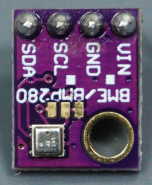
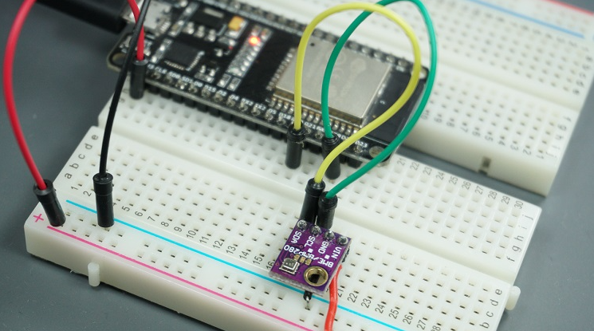
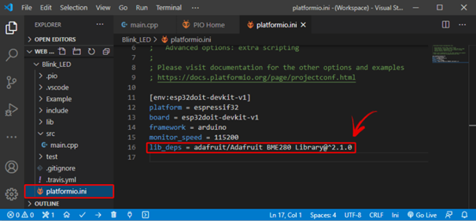

# Installing ESP32/ESP8266 Libraries on PlatformIO IDE

Een standaard project (sketch) kan worden uitgebreid met library's. Die library's zijn stukken code die bepaalde functies toelaten om in de code te gebruiken. Voor veel externe hardware ( sensoren / actuatoren) die kan gekoppeld worden aan de microcontroller kan een library worden gevonden op het internet. Hier wordt besproken om een sensor, die temperatuur en vochtigheid kan meten, toe te voegen aan het bestaand project. Het type sensor is BME280.

Zoek een library voor deze sensor : "Adafruit_BME280"



Klik op de library die je wil toevoegen aan het project: klik Add to Project.



Selecteer het project waar de library moet worden toegevoegd:


Hiermee wordt de bibliotheek identifier toegevoegd met behulp van de lid_deps-richtlijn in het platformio.ini-bestand. Als u het platformio.ini-bestand van uw project opent, zou het eruit moeten zien zoals in de volgende afbeelding.



Als alternatief kunt u in het bibliotheekvenster, als u het tabblad Installatie selecteert en een beetje scrolt, de id voor de bibliotheek zien. U kunt elk van deze ID's kiezen, afhankelijk van de opties die u wilt gebruiken. De bibliotheek-ID's zijn rood gemarkeerd.


Ga vervolgens naar het platformio.ini-bestand van uw project en plak de bibliotheek-ID in dat bestand, zoals dit:

```cpp
lib_deps = adafruit/Adafruit BME280 Library@^2.1.0
```

Als je meerdere bibliotheken nodig hebt, kun je hun naam scheiden door een komma of ze op verschillende regels zetten. Bijvoorbeeld:

```cpp
lib_deps = 
arduino-libraries/Arduino_JSON @ 0.1.0 
adafruit/Adafruit BME280 Library @ ^2.1.0 
adafruit/Adafruit Unified Sensor @ ^1.1.4
```

PlatformIO heeft een ingebouwde krachtige bibliotheekmanager, waarmee u aangepaste afhankelijkheden per project kunt specificeren in het projectconfiguratiebestand platformio.ini met behulp van lib_deps. Dit zal PlatformIO vertellen om automatisch de bibliotheek en al zijn afhankelijkheden te downloaden wanneer u het configuratiebestand opslaat of wanneer u uw project compileert.
