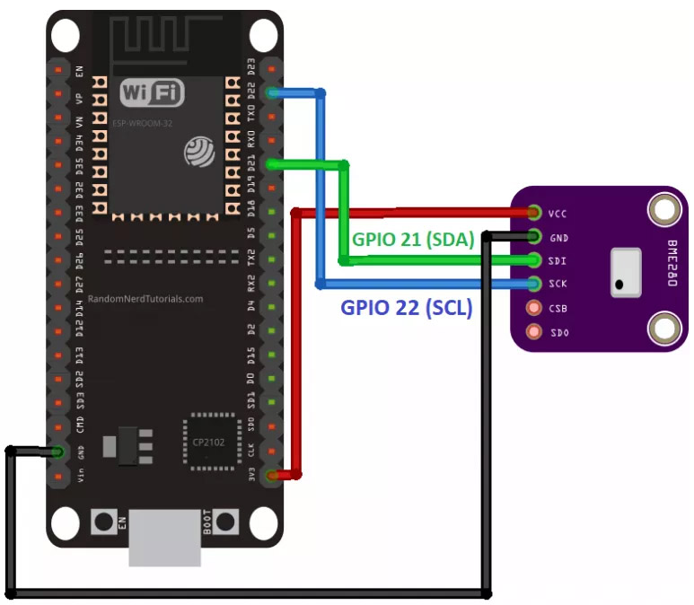
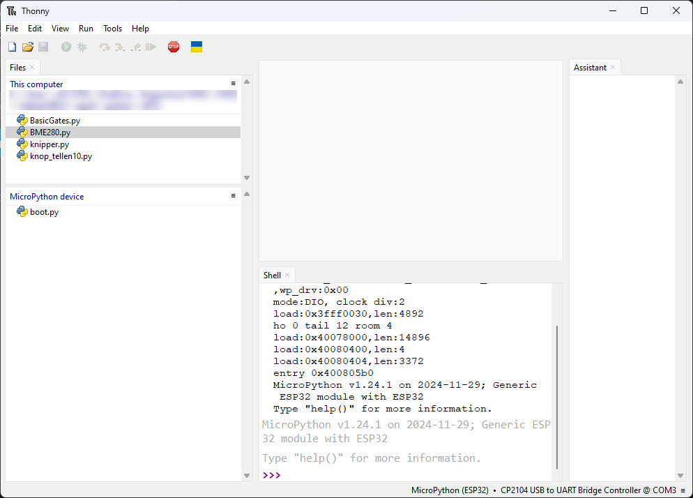
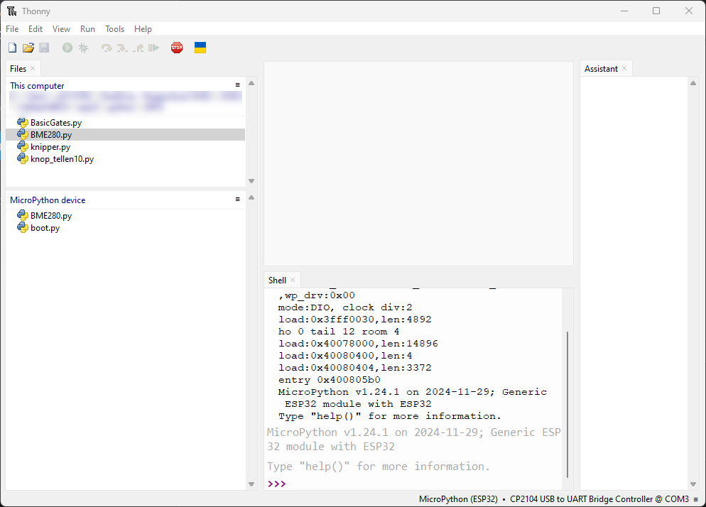

# Installing ESP32 Libraries on MicroPython

Een standaard project kan worden uitgebreid met library's. Die library's zijn stukken code die bepaalde functies toelaten om in de code te gebruiken. Voor veel externe hardware ( sensoren / actuatoren) die kan gekoppeld worden aan de microcontroller kan een library worden gevonden op het internet. Hier wordt besproken om een sensor, die temperatuur en vochtigheid kan meten, toe te voegen aan het bestaand project. Het type sensor is BME280 (slave) die via een I2C (SDA-SCL) bus communiceert met de ESP32 (master).

De library wordt best op het device geïnstalleerd. Hier volgt een voorbeeld.

## Introductie BME280 sensor

Deze sensor registreert barometrische luchtdruk, temperatuur en vochtigheid. Aangezien de luchtdruk wijzigt met de hoogte, kan deze sensor ook gebruikt worden als hoogtemeter. 


Deze sensor communiceert door gebruik te maken van de I2C communicatie protocol, dit vergemakkelijkt de bedrading. In de volgende tabel zijn de verbindingen af te leiden uit de tabel:

| **BME280**    | **ESP32** |
| -------- | ------- |
| Vin  | 3.3V    |
| GND | GND     |
| SCL    | GPIO 22    |
| SDA    | GPIO 21    |

In een schema ziet dit als volgt uit:



## Gebruik van de library

Zoek (vb Github), download, kopieer of maak zelf een bestand BME280.py met de juiste content. Lees de info omtrent het library bestand.


Zet dit bestand in dezelfde map als de MicroPython PY broncode bestanden op de computer.



Druk RMT op dit bestand en lies voor **Upload to /**



De library staat op het MicroPython device en kan nu worden aangesproken. Dit kan zeker ook vanaf een python bestand die op de computer staat en die zal worden uitgevoerd eenmaal er op de groene start knop wordt gedrukt.


```python
# Complete project details at https://RandomNerdTutorials.com

from machine import Pin, I2C
from time import sleep
import BME280

# ESP32 - Pin assignment
i2c = I2C(scl=Pin(22), sda=Pin(21), freq=10000)

while True:
  bme = BME280.BME280(i2c=i2c)
  temp = bme.temperature
  hum = bme.humidity
  pres = bme.pressure
  # uncomment for temperature in Fahrenheit
  #temp = (bme.read_temperature()/100) * (9/5) + 32
  #temp = str(round(temp, 2)) + 'F'
  print('Temperature: ', temp)
  print('Humidity: ', hum)
  print('Pressure: ', pres)

  sleep(5)

```
