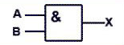
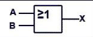
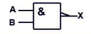
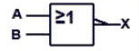
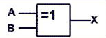
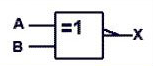

---
mathjax:
  presets: '\def\lr#1#2#3{\left#1#2\right#3}'
---

# Digitale Logische Poorten

Logische poorten zijn de bouwstenen van digitale elektronica. Elke logische poort voert een eenvoudige logische digitale bewerking uit op een of meer invoersignalen en produceert een enkele uitvoer.

## 0. YES Poort

De **YES**-poort neemt één invoer en stuurt deze naar de uitgang. Als de invoer `1` is, is de uitvoer `1` en omgekeerd.

**Waarheidstabel:**

| Invoer (A) | Uitvoer (X) |
|------------|-------------|
| 0          | 0           |
| 1          | 1           |

**Symbol:**

## 1. NOT Poort (Inverter)

De **NOT**-poort (ook wel een **inverter** genoemd) neemt één invoer en keert deze om. Als de invoer `1` is, is de uitvoer `0` en omgekeerd.

**Waarheidstabel:**

| Invoer (A) | Uitvoer (X) |
|------------|-------------|
| 0          | 1           |
| 1          | 0           |

**Symbol:**

## 2. AND Poort

De **AND**-poort geeft alleen een `1` als ALLE ingangen `1` zijn.

**Waarheidstabel:**

| Invoer (A) | Invoer (B) | Uitvoer (X) |
|------------|------------|-------------|
| 0          | 0          | 0           |
| 0          | 1          | 0           |
| 1          | 0          | 0           |
| 1          | 1          | 1           |

**Symbol:**

## 3. OR Poort

De **OR**-poort geeft een `1` als ten minste één invoer `1` is.

**Waarheidstabel:**

| Invoer (A) | Invoer (B) | Uitvoer (X) |
|------------|------------|-------------|
| 0          | 0          | 0           |
| 0          | 1          | 1           |
| 1          | 0          | 1           |
| 1          | 1          | 1           |

**Symbol:**

## 4. NAND Poort

De **NAND**-poort is het tegenovergestelde van de AND-poort. De uitvoer is `0` alleen als ALLE ingangen `1` zijn.

**Waarheidstabel:**

| Invoer (A) | Invoer (B) | Uitvoer (X) |
|------------|------------|-------------|
| 0          | 0          | 1           |
| 0          | 1          | 1           |
| 1          | 0          | 1           |
| 1          | 1          | 0           |

**Symbol:**

## 5. NOR Poort

De **NOR**-poort is het tegenovergestelde van de OR-poort. De uitvoer is `1` alleen als ALLE ingangen `0` zijn.

**Waarheidstabel:**

| Invoer (A) | Invoer (B) | Uitvoer (X) |
|------------|------------|-------------|
| 0          | 0          | 1           |
| 0          | 1          | 0           |
| 1          | 0          | 0           |
| 1          | 1          | 0           |

**Symbol:**

## 6. XOR Poort

De **XOR**-poort (Exclusieve OF) geeft een `1` wanneer de ingangen verschillend zijn.

**Waarheidstabel:**

| Invoer (A) | Invoer (B) | Uitvoer (X) |
|------------|------------|-------------|
| 0          | 0          | 0           |
| 0          | 1          | 1           |
| 1          | 0          | 1           |
| 1          | 1          | 0           |

**Symbol:**

## 7. XNOR Poort

De **XNOR**-poort (Exclusieve-NOR) is het tegenovergestelde van de XOR-poort. De uitvoer is `1` wanneer de ingangen gelijk zijn.

**Waarheidstabel:**

| Invoer (A) | Invoer (B) | Uitvoer (X) |
|------------|------------|-------------|
| 0          | 0          | 1           |
| 0          | 1          | 0           |
| 1          | 0          | 0           |
| 1          | 1          | 1           |

**Symbol:**

---

Dit zijn de basislogische poorten die worden gebruikt in digitale schakelingen. Elke poort kan worden gecombineerd om complexe logische functies te creëren.

***

Opdracht: Maak van iedere logische poort functie een werkend programma op de microcontroller zodat drukknoppen gebruikt worden als input voor een logische poort en een LED de uitgang. Combineer alle poorten in één en hetzelfde programma. Met twee drukknoppen die alle inputs van alle poorten bedienen en er zijn LED's op de shield voldoende om voor iedere output een LED aan te sturen.

***